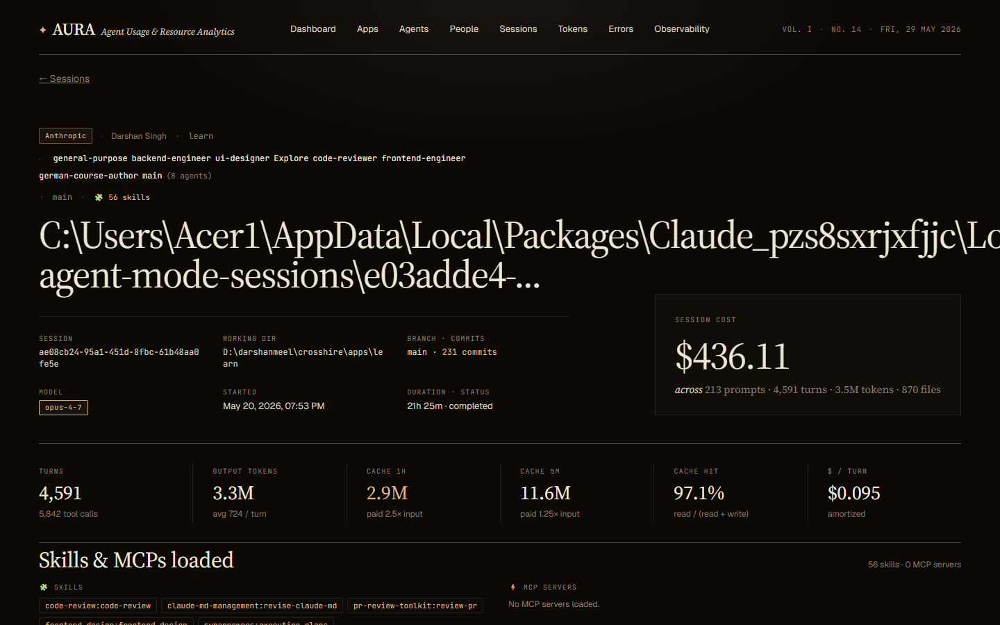
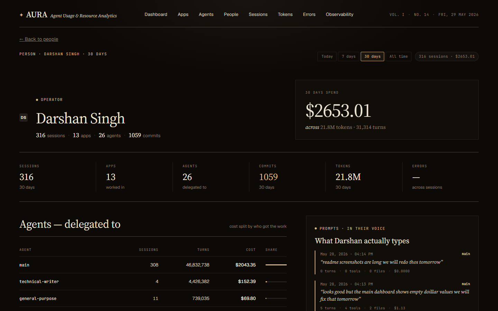
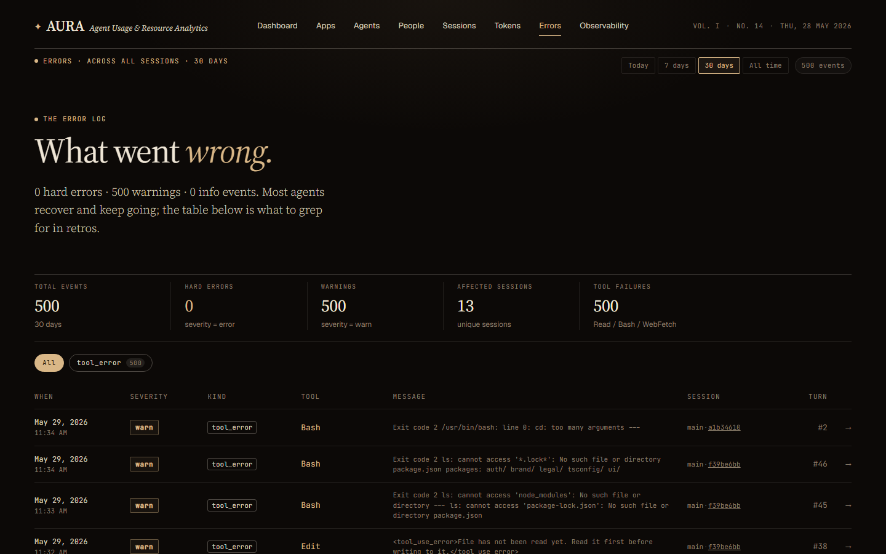

# AURA — Agent Usage & Resource Analytics

A local-first, Dockerized analytics platform for AI coding agent sessions (Claude Code today; Gemini, Codex, and friends on the roadmap). Aura watches your agent transcripts, transforms them through dbt, and surfaces cost, productivity, behavioural and pipeline-health signals through a Next.js dashboard. All data stays on your machine.

> *Spend, with receipts.*

**Built for the individual first.** You run Aura on your own machine, against your own transcripts; nothing is uploaded anywhere. **Designed for the team second:** the same pipeline is built so that each developer's *processed, privacy-masked* marts — never raw conversations — can be shipped to a central store and served through one team-wide dashboard. The schema (`tenant_id`, `person_id`) is already plumbed for it; see [From individual to team](#from-individual-to-team-central-rollout).

📖 **Documentation** — start here:
- [docs/screens/OVERVIEW.md](docs/screens/OVERVIEW.md) — operator's guide: when to open which screen, conventions, data lineage
- [docs/screens/HOW-IT-WORKS.md](docs/screens/HOW-IT-WORKS.md) — architecture deep-dive: watcher internals, dbt layers, agent attribution, failure modes
- [docs/screens/](docs/screens/) — 13 per-screen `.md` reference docs + screenshots

---

## Why Aura

If you use Claude Code, Cursor, Aider, or any agentic coding assistant, you are already producing a goldmine of structured data on how you and your team think, debug, and ship. Aura turns that exhaust into a usable record:

- **Cost transparency** — every dollar spent, broken down by model, agent, project, person, and individual prompt. Every page that shows a cost reconciles to the same total for the same time range.
- **Operator visibility** — who is using which agent, what they ask for, and what gets delivered
- **Quality signals** — overkill detection (used Opus for a one-liner?), error rates per agent, cache hit rates, time-to-completion
- **Replay** — every prompt and response, tool call by tool call, with attribution back to the file paths that were edited
- **Pipeline observability** — built-in `/observability` tab shows ingestion freshness, dbt run status, source-freshness checks, and watcher failures so you always know whether the numbers you're looking at are current

Designed for individuals who want introspection on their own AI usage, and for teams who want a shared, honest picture of agent ROI.

---

## Architecture

Two truly independent stages: JSON → bronze (the watcher's job) and bronze → marts (dbt's job). dbt runs on a fixed interval (`AURA_DBT_RUN_INTERVAL_MINUTES`; the shipped compose file uses 25 min) against whatever lives in `raw_events` at that moment — it does not wait for backfill to finish, and an in-progress backfill does not block dbt cycles. A periodic `sweep_worker` re-scans for any JSONL bytes the live observer missed, so ingestion self-heals even if the filesystem observer stalls.

```
┌────────────────────┐    ┌─────────────────────────┐    ┌──────────────────────┐
│  ~/.claude/        │───▶│  watcher (Py)           │───▶│  /data/aura.duckdb   │
│  projects/*.jsonl  │    │  PollingObserver +      │    │  ── WRITE DB ──      │
│                    │    │  adapter +              │    │  raw_events          │
│                    │    │  ingest_checkpoints +   │    │  session_meta        │
│                    │    │  log_error()            │    │  watcher_errors      │
└────────────────────┘    └─────────────────────────┘    │  ingest_checkpoints  │
                                     │                   └──────────┬───────────┘
                                     │ dbt subprocess               │
                                     │ (freshness → seed →          │ snapshot_worker
                                     │  run → test,                 │ (atomic os.replace
                                     │  every 25 min)               │  every 10 min)
                                     ▼                              ▼
              ┌───────────────────────────┐         ┌──────────────────────────┐
              │  dbt models (in place)    │         │  /data/read/aura.duckdb  │
              │  ── BRONZE: raw_events    │         │  ── READ DB (snapshot) ──│
              │  ── STAGING: stg_*        │         └────────────┬─────────────┘
              │  ── INTERMEDIATE:         │                      │
              │     int_turns,            │                      │ stat()-aware
              │     int_entity_spend, …   │                      │ DuckDB connection
              │  ── MARTS: dim_sessions,  │                      │ (reopens on new
              │     fact_model_calls,     │                      │  inode)
              │     fact_turns,           │                      ▼
              │     fact_prompts,         │         ┌──────────────────────────┐
              │     fact_daily_spend,     │         │  Next.js 14 (App Router) │
              │     fact_spend_pace,      │         │  localhost:3000          │
              │     dim_apps, dim_people, │         │                          │
              │     dim_agents, …         │         │  /                       │
              └───────────┬───────────────┘         │  /apps, /agents, /people │
                          │                         │  /sessions, /errors      │
                          │ writes                  │  /observability ←────────┼─┐
                          │ target/                 └──────────────────────────┘ │
                          ▼                                                      │
              ┌───────────────────────────┐                                      │
              │  /data/artifacts/         │                                      │
              │  run_results.json         │──────────────────────────────────────┘
              │  sources.json             │  (read by /api/observability)
              │  manifest.json            │
              └───────────────────────────┘
```

| Surface | Language | Purpose |
|---|---|---|
| `watcher/` | Python 3.11 + `watchdog.PollingObserver` + DuckDB | Tail JSONL logs (works on Windows bind-mounts via polling), redact secrets, write `raw_events`, persist `watcher_errors` on every caught exception |
| `dbt/` | SQL + dbt-duckdb 1.11 | Staging → intermediate → marts. Includes `sources.yml` with freshness rules for `raw_events` (warn 5 min / error 30 min) and the `int_entity_spend` model that pre-joins event-timestamped cost to (app, agent, person) keys |
| `frontend/` | Next.js 14 (App Router) + TypeScript + DuckDB node-api | Dashboard, per-entity profile pages, and live-polling Observability tab. Connection layer checks the read DB's inode on every query so it never serves stale data after a snapshot |

---

## What you get on the dashboard

| Page | What it shows |
|---|---|
| **Dashboard** (`/`) | Hero "Spend, with receipts." + 14-day cost, KPI strip (active sessions, cache hit rate, tool calls, commits, errors, 30-day projection), daily spend chart, apps ledger, projects rollup, agents table (now with app/project context), files, errors, tool mix, providers, models, cache split, loudest prompt of the day |
| **Apps** (`/apps`) | Every app you've worked in — cost, sessions, turns, commits, agents in rotation |
| **App detail** (`/apps/[appId]`) | Agents in this app, **People in this app**, sibling apps in the project, recent sessions, full chronological prompt feed |
| **Agents** (`/agents`) | Every agent × app row (same agent name in different apps shows separately) — sortable by cost, sessions, turns |
| **Agent detail** (`/agents/[name]`) | **People delegating** to this agent, apps served, models routed to, recent sessions, top files touched, prompts directed at this agent |
| **People** (`/people`) | Rich operator cards: cost, sessions, turns, commits, apps chips, agents chips, % of org spend |
| **Person detail** (`/people/[personId]`) | Agents this person delegates to, apps they work in, recent sessions, **"What {name} actually types"** prompt log |
| **Sessions** (`/sessions`) | Filterable ledger of every session with title, model, turns, cost, person, agent |
| **Session detail** (`/sessions/[id]`) | Per-turn ledger (the default Details view) with tabs for prompts, agents, errors, files, tokens, tools, git |
| **Errors** (`/errors`) | Hard errors, warnings, tool failures across all sessions with filters by kind/tool/severity |
| **Observability** (`/observability`) | Single consolidated pipeline view: derived verdict block, 5-stage flow strip (Watcher → Bronze → Silver → Gold → Consumers), medallion-layer cards with per-table rows / size / age, 4-column KPI grid, 1h/1d/7d ingestion sparklines, source freshness table, dbt test grid + per-relation breakdown, last 6 dbt invocations, live watcher errors feed, expandable `run_results.json` / `sources.json`. Polls every 10 s. |

---

## Project layout

```
AURA/
├── watcher/        Python package — JSONL adapter, DuckDB writer, snapshot + dbt workers
├── dbt/            dbt project — staging → intermediate → marts, model_pricing seed
├── frontend/       Next.js 14 app — dashboard, per-entity pages, Observability tab
├── docs/           Architecture notes, screenshots, code-review audit
└── .claude/        Agent definitions (runner, data-engineer, dbt-expert, frontend-engineer)
```

`watcher/`, `dbt/`, and `frontend/` are the three independent surfaces. Changes to one rarely need to touch the others — see the surface map in [CLAUDE.md](CLAUDE.md) for routing guidance.

---

## Tech stack

- **Ingestion:** Python 3.11, `watchdog.PollingObserver` (works on Windows / Docker bind-mounts where inotify silently drops events), `duckdb` Python client
- **Storage:** DuckDB (single write DB at `/data/aura.duckdb`; read replica at `/data/read/aura.duckdb` produced by atomic snapshot)
- **Transform:** dbt 1.11 with `dbt-duckdb` adapter, staging / intermediate / marts pattern. `dbt source freshness` declared for `raw_events`; `target/run_results.json` and `target/sources.json` copied to `/data/artifacts/` after every cycle for frontend consumption
- **Pricing:** SCD-style `model_pricing` seed (per-tenant overrides supported)
- **Frontend:** Next.js 14 App Router, TypeScript, server components reading DuckDB directly. Connection layer uses `fs.stat().ino` to detect when the snapshot worker replaces the read DB and transparently reopens, so the page never serves stale data after a snapshot.
- **Container:** Docker Compose, two services (`watcher`, `frontend`) sharing the `./data` volume. Frontend mounts it read-only.

---

## Quick start (Docker)

**Requirements:** Docker, Docker Compose, and an existing `~/.claude/projects/` directory with at least one session.

```bash
git clone https://github.com/<you>/AURA.git
cd AURA
cp .env.example .env   # set your identity vars — defaults work out of the box
docker-compose up --build
```

Then open `http://localhost:3000`.

> **Data staleness expectations:** the dashboard is **not real-time**. The
> read DB is refreshed every `AURA_SNAPSHOT_INTERVAL` (600 s in the shipped
> compose file) and dbt rolls up bronze → marts every
> `AURA_DBT_RUN_INTERVAL_MINUTES` (25 min) — together the numbers you see can
> lag reality by up to ~35 min. `/observability` shows the exact age of every
> layer if you need to know precisely how fresh a given number is.

On first boot the `watcher` container:

1. Purges any orphaned DuckDB spill files left in `{AURA_DB_PATH}.tmp` by a previous unclean shutdown (leftover spill files poison DuckDB's temp-size accounting and cause spurious OOMs on the heaviest models).
2. Starts the `snapshot_worker`, `dbt_worker`, and `sweep_worker` threads **immediately** (they run independently of each other and of the backfill).
3. Backfills every existing `.jsonl` file under `AURA_LOGS_DIR`, **oldest first**, so the ingestion-lag metric on `/observability` counts down truthfully as the catch-up progresses. Backfill is idempotent: byte offsets are tracked in `ingest_checkpoints`, so re-runs never double-write.
4. Hands off to the `PollingObserver`, which scans the logs directory every 10 s and processes any new bytes appended to JSONL files. Polling (not inotify) is used so the watcher works on Windows / Docker bind-mounts where filesystem events are unreliable. The `sweep_worker` re-scans on its own interval and ingests anything the observer missed — a stalled observer can no longer freeze ingestion silently.

While backfill is running, the `dbt_worker` fires its first cycle in parallel — it transforms whatever already exists in `raw_events` rather than waiting. The `dbt source freshness` step is skipped until the initial backfill completes (before that point staleness is expected, not a signal); on later cycles freshness runs at the **top** of the cycle, right after the window in which ingestion was free to catch up, so it measures ingestion health rather than dbt-cycle duration. Subsequent cycles run every `AURA_DBT_RUN_INTERVAL_MINUTES` minutes. The frontend reads from a snapshot of the DuckDB file (refreshed every `AURA_SNAPSHOT_INTERVAL` seconds when no dbt cycle is in flight) and the connection layer transparently reopens whenever the underlying file is replaced.

Environment variables (all have sensible defaults):

| Variable | Default | What it does |
|---|---|---|
| `AURA_LOGS_DIR` | `/logs/claude` | Where to look for `.jsonl` files inside the watcher container |
| `AURA_DB_PATH` | `/data/aura.duckdb` | Write-side DuckDB file |
| `AURA_READ_DB_PATH` | `/data/read/aura.duckdb` | Read-side snapshot (consumed by frontend). The basename must match `AURA_DB_PATH` so dbt-compiled views resolve against the same catalog name |
| `AURA_SNAPSHOT_INTERVAL` | `2` (code) / `600` in compose | Seconds between snapshot refreshes (snapshot worker waits while a dbt cycle holds the DB). The shipped compose uses 600 s — the dashboard doesn't need real-time freshness, and frequent snapshots of a multi-GB DB are expensive |
| `AURA_DBT_RUN_INTERVAL_MINUTES` | `5` (code) / `25` in compose | How often the dbt cycle (`source freshness` → `seed` → `run` → `test`) runs. The compose value leaves room between cycles for ingestion to catch up — the cycle holds the write-DB lock for its full duration |
| `AURA_SWEEP_INTERVAL_SECONDS` | `600` | How often the `sweep_worker` re-scans for JSONL bytes the live observer missed (`0` or negative disables). Safety net that makes ingestion self-healing; logs an `ingest_liveness` watcher error when the observer is persistently lagging |
| `AURA_DBT_MEMORY_LIMIT` | `4GB` | DuckDB memory ceiling for the dbt subprocess (see `dbt/profiles.yml`). A **soft** cap — DuckDB spills heavy joins/aggregations to disk rather than OOM-ing. Keep it ~1 GB below the container `mem_limit` so DuckDB spills before the container is OOM-killed |
| `AURA_DBT_THREADS` | `4` | How many dbt models build concurrently. Lower it if a cycle exhausts memory on a small box; raise it to parallelize on a bigger one |
| `CLAUDE_LOGS_DIR` | `~/.claude/projects` | Host-side path to mount into the watcher |
| `AURA_QUERY_TIMEOUT_MS` | `15000` | Maximum milliseconds a single DuckDB query may run before being aborted (frontend) |
| `AURA_REDACT_PAYLOAD` | `true` | Set to `false` to disable secret/base64 redaction in payload (raw JSONL passes through unchanged) |
| `AURA_HASH_CONTENT` | `` (off) | Set to `1` or `true` to hash conversational text (`message.content`) to `sha256:<hex>` at ingest time — see [Privacy: column masking](#privacy-column-masking-before-anything-leaves-the-machine). Applies to new ingests only; disables session replay for events ingested while on |
| `AURA_MODEL_WINDOWS_JSON` | `{}` | Optional JSON object to override model context window sizes, e.g. `{"new-model-id":1000000}` |
| `AURA_ARTIFACTS_DIR` | `/data/artifacts` | Where the watcher copies dbt's `run_results.json` / `sources.json` / `manifest.json` after each cycle; the frontend reads these from the same path |

---

## Running without Docker (local dev)

You can run the three surfaces natively — no containers. This is the fastest
inner loop for watcher/dbt/frontend work.

**Requirements:** Python **3.12** (3.13/3.14 are not yet supported by the pinned
`dbt-duckdb`/`duckdb` wheels), Node 18+, and an existing `~/.claude/projects/`
with at least one session.

### 0. Point the stack at local paths

Unlike Docker, there's no `/data` mount — pick a working directory and export
the paths the watcher, dbt, and frontend all read. Do this in **every** shell
you open (or add to your shell profile).

```bash
# macOS / Linux (bash/zsh)
export AURA_LOGS_DIR="$HOME/.claude/projects"      # your Claude Code transcripts
export AURA_DB_PATH="$HOME/aura/aura.duckdb"        # write DB (watcher + dbt)
export AURA_READ_DB_PATH="$HOME/aura/read/aura.duckdb"  # read snapshot (frontend)
mkdir -p "$HOME/aura/read"
```

```powershell
# Windows (PowerShell)
$env:AURA_LOGS_DIR     = "$HOME\.claude\projects"
$env:AURA_DB_PATH      = "$HOME\aura\aura.duckdb"
$env:AURA_READ_DB_PATH = "$HOME\aura\read\aura.duckdb"
New-Item -ItemType Directory -Force "$HOME\aura\read" | Out-Null
```

The read DB's **basename must match** the write DB (`aura.duckdb`) so
dbt-compiled views resolve against the same catalog — keep them in sibling
directories as above.

### 1. Watcher

```bash
cd watcher
python -m venv .venv && source .venv/bin/activate   # Windows: .venv\Scripts\Activate.ps1
pip install -e .
python -m aura_watcher.main
```

On start it backfills every `.jsonl` under `AURA_LOGS_DIR` (newest first), then
tails for changes, snapshots the read DB, and — if `dbt` is on PATH — runs the
dbt cycle every `AURA_DBT_RUN_INTERVAL_MINUTES`. Leave it running.

> The watcher also invokes `dbt` and the Node number-verify script as
> subprocesses. If you'd rather drive dbt by hand (below), that's fine — the
> embedded cycle is best-effort and logs, never crashes, when a tool is missing.

### 2. dbt (in a second shell, after the watcher has written some rows)

```bash
cd dbt
pip install dbt-duckdb          # once, ideally in its own 3.12 venv
dbt seed  --profiles-dir .
dbt run   --profiles-dir .
dbt test  --profiles-dir .      # optional; failures don't block models
```

`dbt/profiles.yml` already reads `AURA_DB_PATH` from the environment, so no
profile editing is needed — just keep the same env vars exported.

### 3. Frontend (a third shell)

```bash
cd frontend
npm install
npm run dev     # http://localhost:3000
```

The frontend reads **only** `AURA_READ_DB_PATH` (the snapshot the watcher
produces), checking the file's inode on every query so it transparently
reopens after each snapshot.

All other `AURA_*` environment variables from the Docker table above apply
identically here.

---

## Configuring people

By default, every session is attributed to the host OS user (`getpass.getuser()`). To make the People page meaningful with friendly display names, create `~/.aura/people.json`:

```json
{
  "alice": { "name": "Alice Liu", "role": "Founding engineer" },
  "bob":   { "name": "Bob Chen",  "role": "Designer" }
}
```

Keys are OS usernames; values flow into `session_meta` at ingestion time.

---

## Screenshots

Captured against the live local stack. Every shot below is the
above-the-fold viewport (1440×900) — the first screen you see on each
page, not a full-page scroll capture.
For per-screen documentation see [docs/screens/](docs/screens/) — start
with [OVERVIEW.md](docs/screens/OVERVIEW.md) for navigation and
[HOW-IT-WORKS.md](docs/screens/HOW-IT-WORKS.md) for architecture.

### Dashboard
Single summary screen — cost, token volume, ledgers for apps/projects/agents,
heatmap, side panels, and Skills & MCPs at the bottom.


### Tokens drill-down
Token spend broken down by type, provider, model, and agent. Hourly
buckets on `range=today`, daily otherwise. Distinct colour palette per
token type (teal/gold/orange/violet/slate).


### Sessions list & Session detail
Filterable ledger of every session with 🧩 (skills) + ⚡ (MCPs) count
columns and multi-agent rendering; then a per-session deep-dive — the
detail shot below is the default **Details** view (per-turn ledger and
stat cards) that opens when you click a session.




### Apps & App detail
Card grid by cost; per-app rollup with sessions, agents, people, sibling
apps, prompt feed, and a "Skills & MCPs in this app" panel.


### Agents & Agent detail
Subagent roster with **real attribution** (technical-writer, frontend-engineer,
code-reviewer, …) — `fact_model_calls.agent` now joins
`int_event_agent.agent_resolved` so spend no longer lumps under one
`claude` row. Footnote on the list explains the `main` bucket.


### People & Person detail
Operator roster with real names (311 / 349 sessions resolve to the
configured `AURA_DEFAULT_PERSON_*`); per-person profile with agents
delegated to, apps worked in, and the operator's prompt log.




### Errors
Hard errors, warnings, and tool failures from `fact_errors`, filterable
by kind and tool. Timestamps now carry date + time (e.g. `May 28 ·
09:57:26`).



### Observability
Pipeline health at a glance — verdict, flow strip, medallion layer ages,
KPI grid, ingestion volume, source freshness, dbt tests, recent watcher
errors. Polls every 10 s via `/api/observability`.


---

## Notable behaviour

- **Pricing is SCD-aware.** The `model_pricing` seed has `valid_from` / `valid_to` columns; cost calculation joins on the timestamp of the model call, so historical sessions stay correctly priced even when rates change.
- **Cost is anchored to event timestamp, never session-start.** All cost aggregations across the dashboard derive from `fact_model_calls.calculated_cost` filtered by `CAST(ts AS DATE)`. Session-start (`dim_sessions.start_ts`) is used only for counting sessions and computing behavioural metrics — never for cost. A session that began yesterday but ran into today gets its yesterday's tokens counted on yesterday and its today's tokens counted on today.
- **Cost reconciles across all pages.** `int_entity_spend` pre-aggregates `fact_model_calls` to `(date × app/agent/person)` grain. Every range-filtered cost on Dashboard, Apps, Agents, People, and their detail pages pulls from this single source — so the total cost on the dashboard equals the sum of app costs equals the sum of agent costs for the same date range. No drift, no double-counting cache tokens, no provider/start-ts mismatch.
- **Cache hit rate uses the right denominator.** `cache_read / (cache_read + cache_write_5m + cache_write_1h)` — not `cache_read / input_tokens`.
- **Agents are tracked per app**, not just by name. `runner` in your Aura project and `runner` in another project show up as separate rows.
- **Overkill detection.** `fact_prompts` scores each external prompt on a complexity tier (S/M/L/XL by char count, tool calls, files edited) and compares it to the model tier (Haiku/Sonnet/Pro/Opus). If you used Opus to fix a typo, the prompt gets flagged.
- **Sidechain agent attribution.** When the main agent dispatches to a subagent via the `Task` tool, every event between dispatch and result is attributed to that subagent in `int_event_agent` and inherits into `dim_agents` / `fact_prompts`.
- **Backfill is all-or-nothing on the bronze layer.** Both `process_file` (backfill / polling path) and `on_created` (new-file event path) block on `_snapshot_lock` if a dbt cycle is in flight, then write once the lock releases. Earlier versions short-circuited on a `dbt_running` flag in both handlers, which silently dropped any file whose entire processing happened to fall inside a dbt cycle — that bug is gone from both paths.
- **The frontend never serves stale data after a snapshot.** The watcher's snapshot uses `os.replace()` (atomic rename, new inode). The frontend's `lib/db.ts` checks the file's inode on every `getInstance()` call and reopens the DuckDB connection if it has changed.
- **Watcher failures are persisted.** Every `except` block in `main.py` calls `writer.log_error(source, file_path, exception)`, which writes a row to the `watcher_errors` table with full traceback. The Observability → Watcher page renders the most recent failures with expandable stack traces.

---

## Troubleshooting

Operational issues diagnosed while running Aura against a real, growing transcript set. The tuning knobs referenced below all live as commented environment variables in `docker-compose.yml` — read the comments there for the full numeric history if you're changing them.

- **Ingestion stalls / "ingestion halted" alarm.** Two independent causes, both are lock-contention on the single write DB:
  - *Snapshot-interval starvation.* `take_snapshot` copies the **whole** DuckDB file while holding `_snapshot_lock`; on a multi-GB DB that copy takes minutes. If `AURA_SNAPSHOT_INTERVAL` is shorter than the copy duration, snapshots run effectively back-to-back and never release the lock for live ingestion. The shipped compose uses `600` (was `30`, which starved ingestion continuously).
  - *dbt cycle lock contention.* A dbt cycle holds the same write-DB lock for its **full duration** (`source freshness` → `seed` → `run` → `test`), so ingestion and snapshots wait behind it. If `AURA_DBT_RUN_INTERVAL_MINUTES` is shorter than (or close to) how long a cycle actually takes, cycles run back-to-back and starve ingestion — this has been observed to leave `raw_events` **hours** stale. The interval must comfortably **exceed** cycle time; the shipped compose uses `25` min.
- **Out of Memory during dbt.** `AURA_DBT_MEMORY_LIMIT` is a *soft* DuckDB pool ceiling — keep it roughly **1 GB below** the container's `mem_limit` so DuckDB spills heavy joins/aggregations to disk instead of the container OOM-killing the `dbt` process outright. If a model still OOMs at the current ceiling, lower `AURA_DBT_THREADS` (how many models build concurrently) and/or `AURA_DBT_DUCKDB_THREADS` (DuckDB's own per-query thread count — fewer parallel hash tables per query is DuckDB's documented OOM remedy) before raising the memory ceiling further. Two OOM signatures look different and mean different things:
  1. `Out of Memory ... 16383.9 PiB used` — **not** a real pool exhaustion. This nonsensical number comes from orphaned spill files left in `{AURA_DB_PATH}.tmp` after an unclean shutdown, which poisons DuckDB's temp-size accounting on the next start. The watcher purges these at startup now, but if you see this figure after manually killing the container, delete `{AURA_DB_PATH}.tmp` yourself.
  2. A genuine pool exhaustion reports a sane figure instead, e.g. `3.7 GiB/3.7 GiB used` — this means raise `AURA_DBT_MEMORY_LIMIT` (within the ~1 GB headroom rule above) or lower the thread knobs.
- **`docker compose stop` hangs / container won't die.** The watcher spawns `dbt run` as a subprocess; without an init process as PID 1, a `dbt` child that dies mid-signal becomes an unreapable zombie and stop/restart wedges (symptom: "PID is zombie and can not be killed", requiring `docker rm -f`). `init: true` on the `watcher` service runs a tiny init that forwards signals and reaps children — this should not recur; if it does, confirm `init: true` is still present.
- **No `source freshness` result on the first cycle after startup.** Expected — the watcher prints `Skipping source freshness — initial backfill not complete` instead of running the check, since staleness is meaningless before the backfill has caught up. From the second cycle onward, freshness runs at the top of the cycle (right after the window where ingestion caught up) and reflects real ingestion health — so a genuine `ERROR STALE` there means ingestion really is behind (check the sweep worker and `watcher_errors`).

---

## Performance & materialization strategy

Almost every dbt model in this repo is `table` (full rebuild on each cycle) or `view`. The exceptions are **`fact_prompts`, `stg_tool_results`, and `fact_tool_executions`, which are `incremental` (`delete+insert`)** — their full-history rebuilds (JSON extraction / UNNEST over every tool execution ever recorded) outgrew the DuckDB memory pool first. Because `raw_events.ts` is event-time and frozen at first insert, it is *not* a safe incremental cursor; all three cursor on `ingest_checkpoints.last_seen_at` instead — see the header comment in `dbt/models/marts/fact_prompts.sql` for the full rationale. For everything else, at the data scale this tool was designed for — one developer's transcripts — a full rebuild per cycle is well inside the dbt budget. Switching more models to incremental would add complexity (lookback windows for late-arriving JSONL bytes, `merge` strategies for dimensions that aggregate facts) without measurable wall-clock benefit yet.

**Known limit: a `fact_prompts` full refresh needs the full 4 GB pool.** Routine *incremental* cycles run comfortably inside the shipped `AURA_DBT_MEMORY_LIMIT=4GB`, but a **full rebuild** of `fact_prompts` (first boot, or `dbt run --full-refresh`) genuinely exhausts a 3 GB pool — verified 2026-07 on a ~750k-event DB with working disk spill (`Out of Memory Error: ... 2.7 GiB/2.7 GiB used`), and a CTE-narrowing rewrite of the model still OOM'd at 3 GB. Don't lower the memory ceiling below 4 GB if a full refresh may run; the shipped compose (4 GB pool / 5 g container `mem_limit`) is the tested floor.

**Wide text lives in a view, not a table.** The per-turn `user_prompt` and `assistant_response` (the latter a ~20-branch content-block extraction) are exposed through the `dim_turn_messages` **view** rather than materialized into `fact_turns`. Baking that text into a `table` mart exhausted DuckDB's memory pool on a full rebuild; keeping it as a view computes it on demand for the handful of session-detail rows that actually render it, and leaves `fact_turns` narrow (metrics only) and cheap to rebuild. The extraction logic lives exactly once, in `int_turns` — `dim_turn_messages` is a thin passthrough. This is why `fact_turns` runs comfortably under the `AURA_DBT_MEMORY_LIMIT` default rather than needing a multi-GB pool.

**When to add incremental models.** Revisit this once `raw_events` crosses roughly **1M rows** or a full `dbt build` cycle starts pushing past 2–3 minutes. The natural candidates, in order:

1. `fact_model_calls` — append-only on `event_ts`, easy `unique_key=event_uuid`, `incremental_strategy='delete+insert'` over a lookback window.
2. ~~`fact_tool_executions`~~ (and `stg_tool_results`, its heavy upstream) — **done (2026-07)**: incremental `delete+insert` keyed on `(tenant_id, tool_use_id)` / `(tenant_id, event_uuid)`, cursored on `ingest_checkpoints.last_seen_at`; verified full-column-parity-exact against a full rebuild on a 750k-event DB. `fact_turns` remains a candidate.
3. ~~`fact_prompts`~~ — **done (2026-07)**: incremental `delete+insert` keyed on `(tenant_id, prompt_id)`, cursored on `ingest_checkpoints.last_seen_at`.
4. `int_entity_spend` — incremental on `(date, app_id/agent/person_id)` grain, but only after the upstream facts are incremental too.

**How you'd do it in production.** The pattern (illustrative, not yet in the repo) is the standard dbt-incremental shape:

```sql
-- dbt/models/marts/fact_model_calls.sql (hypothetical production form)
{{ config(
    materialized='incremental',
    unique_key='event_uuid',
    incremental_strategy='delete+insert',
    on_schema_change='append_new_columns'
) }}

SELECT ...
FROM {{ ref('stg_events') }}
WHERE event_type = 'assistant'


  -- 2 h lookback: covers any late-arriving bytes the watcher backfills after
  -- a JSONL was force-flushed (Claude Code can rewrite the tail when a session
  -- is resumed). Anything older than 2 h is considered settled.
  AND event_ts > (SELECT MAX(event_ts) - INTERVAL '2 hours' FROM {{ this }})

```

Dimensions that derive from facts (`dim_sessions`, `dim_apps`, `dim_agents`, `dim_people`) stay `table` even after the facts go incremental — they're cheap to fully rebuild from the now-incremental fact tables, and incremental dimensions are a known source of drift bugs (a session whose cost changed after the fact gets stale dimension rows). Keep the line: facts are append-only and can be incremental; dimensions roll up the current state of facts and should rebuild.

Beyond the dbt layer, the `raw_events` bronze table is already append-only at ingest time (the watcher tracks byte offsets in `ingest_checkpoints` and never re-reads settled prefix bytes), so the bronze stage is effectively incremental without dbt being involved. The bottleneck at scale will be the silver/gold dbt rebuilds, which is what the above plan targets.

---

## From individual to team (central rollout)

Aura is deliberately **hub-and-spoke**, not SaaS. Every developer keeps running the full local stack (watcher → DuckDB → dbt → dashboard) exactly as described above — full detail, fully private. Team visibility is an *export* problem, not a hosting problem: each machine periodically ships its **processed, masked marts** — never raw transcripts — to a central store, and one shared dashboard reads the union.

```
   dev laptop A                dev laptop B                dev laptop C
┌─────────────────┐        ┌─────────────────┐        ┌─────────────────┐
│  Aura (local)   │        │  Aura (local)   │        │  Aura (local)   │
│  full detail,   │        │  full detail,   │        │  full detail,   │
│  private :3000  │        │  private :3000  │        │  private :3000  │
└────────┬────────┘        └────────┬────────┘        └────────┬────────┘
         │    processed marts only — masked, no raw transcripts │
         └──────────────────────────┬───────────────────────────┘
                                    ▼
              central store (MotherDuck / S3 + DuckDB /
                Postgres / any dbt-supported warehouse)
                    rows keyed by tenant_id + person_id
                                    │
                                    ▼
              one team dashboard — the same Next.js app,
              pointed at the central DB (read-only, SSO'd)
```

**What leaves each machine:** the gold-layer marts (`fact_daily_spend`, `fact_model_calls`, `dim_sessions`, `fact_prompts`, …) with every sensitive text column masked (table below). `raw_events` and the JSONL transcripts never leave.

**What's already plumbed for this:**
- every table carries `tenant_id` (always `'local'` today) — set it per developer/machine and central rows never collide;
- `session_meta.person_id` / `person_name` attribute every session to a person (`~/.aura/people.json`);
- the `model_pricing` seed supports per-tenant overrides;
- the dbt project is warehouse-portable — swap the `dbt-duckdb` adapter for Snowflake/BigQuery/MotherDuck and the models carry over;
- the frontend is a read-only consumer of one DuckDB path — pointing it at a central replica is configuration, not surgery.

**What's still to build** *(status: designed, not yet implemented)*: the exporter itself (a small job that pushes masked marts on an interval), central-side dedup on `(tenant_id, natural key)`, and auth/RBAC on the shared dashboard.

### Privacy: column masking before anything leaves the machine

When rolling out to multiple users, it's critical to preserve privacy. **Before any data is shipped to a central server, message and prompt content will be masked so that only the individual user can see their own conversations — not other users, not managers, not admins.**

The following columns contain sensitive content and will be masked or hashed prior to central ingestion:

| Column | Location | Masking approach |
|---|---|---|
| `user_prompt` | `int_turns`, `dim_turn_messages` | SHA-256 hash (content not recoverable) |
| `assistant_response` | `int_turns`, `dim_turn_messages` | SHA-256 hash (content not recoverable) |
| `prompt_text_200` | `fact_prompts` | Masked / nulled out |
| `summary_200` | `fact_prompts` | Masked / nulled out |

**How it works:**
- The log-shipper (or a pre-ship dbt macro) replaces raw text in these columns with a cryptographic hash (SHA-256) before the data leaves the user's machine.
- All other columns — token counts, costs, tool names, timestamps, model IDs — travel unmasked and are safe to aggregate across users.
- A user viewing their own session detail page sees the full decrypted content sourced directly from their local DuckDB, not from the central copy.
- The central warehouse only ever receives hashed values, so even a compromised central store cannot reveal what any developer typed.

> **T8 (implemented, 2026-07-16): local hash mode.** `watcher/src/aura_watcher/redact.py` now implements the ingest-time half of this — `hash_message_content()`, gated behind the `AURA_HASH_CONTENT` env var (default **off**; see the env-var table above). When enabled (`1` or `true`), the watcher replaces `$.message.content` and `$.message.content[N].text` with `sha256:<hex>` markers **at ingest time**, before the line is written to `raw_events.payload` — the single source all four columns (`user_prompt`, `assistant_response`, `prompt_text_200`, `summary_200`) are derived from downstream in dbt. Hashing runs *after* secret redaction (`AURA_REDACT_PAYLOAD`), so a leaked credential is redacted first and the redacted text is what gets hashed. This makes those four columns cryptographically non-recoverable for any row ingested while the flag is on.
>
> **Applies to new ingests only** — turning the flag on does not retroactively rewrite rows already sitting in `raw_events`; only bytes read after the flag is set are hashed. Turning it off later does not un-hash them either.
>
> **Trade-off:** enabling this **disables the session replay / conversation view** (`/sessions/<id>`) for any events ingested while it's on — the underlying text is gone from `raw_events`, not just masked in the UI, so there is nothing left to render. Token counts, costs, tool names, model IDs, and timestamps are unaffected and keep working normally.
>
> **Still to build** (unchanged from before T8): a dbt pre-hook macro / exporter step for the *central-rollout* path (shipping already-collected local data to a shared warehouse) — T8 only covers the local, ingest-time case described above.

> **Note on secret-scanning alerts:** every credential-shaped string in this repo lives in `watcher/tests/test_redact.py` and is **synthetic** — AWS's public documentation example key, the jwt.io demo token, and hand-typed garbage used as redaction test fixtures. No real secret has ever been committed. The fixtures are assembled at runtime from fragments precisely so scanners don't see credential-shaped literals in the source.

### Alternative: fully-centralized deployment

For organizations that would rather ship raw events than processed marts, the heavier path is: a log-shipper (FluentBit/Promtail) on each machine streaming `.jsonl` to S3/Kafka → a cloud warehouse (Snowflake, BigQuery, MotherDuck) running the same dbt project → the Next.js frontend hosted with OAuth/SSO and role-based access → transformations scheduled by Airflow/Dagster/dbt Cloud instead of the embedded worker loop. This trades the privacy guarantee (raw content leaves the machine — masking must happen in the shipper) for operational simplicity at large headcounts.

---

## Roadmap

- [ ] Gemini adapter (architecture is ready; the `model_pricing` seed already has Gemini rows)
- [ ] Codex / Aider adapters
- [ ] Central sync exporter — ship masked marts to a central store on an interval; single team dashboard on top (see *From individual to team* above)
- [ ] Column masking implementation (the privacy plumbing — see above; prerequisite for the exporter)
- [ ] dbt schema tests (`not_null`, `unique`, `relationships`) for primary keys on every mart
- [ ] Multi-tenant auth — `tenant_id` is plumbed through the schema but always `'local'` today
- [ ] Anomaly detection: prompts that spike in cost, agents that suddenly start erroring out
- [ ] MetricFlow / dbt Semantic Layer adoption — wire the existing `dbt/models/marts/aura_semantic.yml` semantic models through to the frontend so KPIs are defined once and reconciled by the layer instead of by hand-written SQL in `frontend/lib/queries/*`
- [ ] Convert the remaining append-only facts to `incremental` as they outgrow the cycle budget (`fact_prompts`, `stg_tool_results`, and `fact_tool_executions` already are — see *Performance & materialization strategy* above; `fact_model_calls` and `fact_turns` are next)
- [ ] Surface dbt source-freshness severity directly on the main Observability card (currently shown only on the dbt sub-page)

---

## Documentation

- [docs/code-review.md](docs/code-review.md) — full codebase audit with prioritized improvement notes

---

## License

MIT
