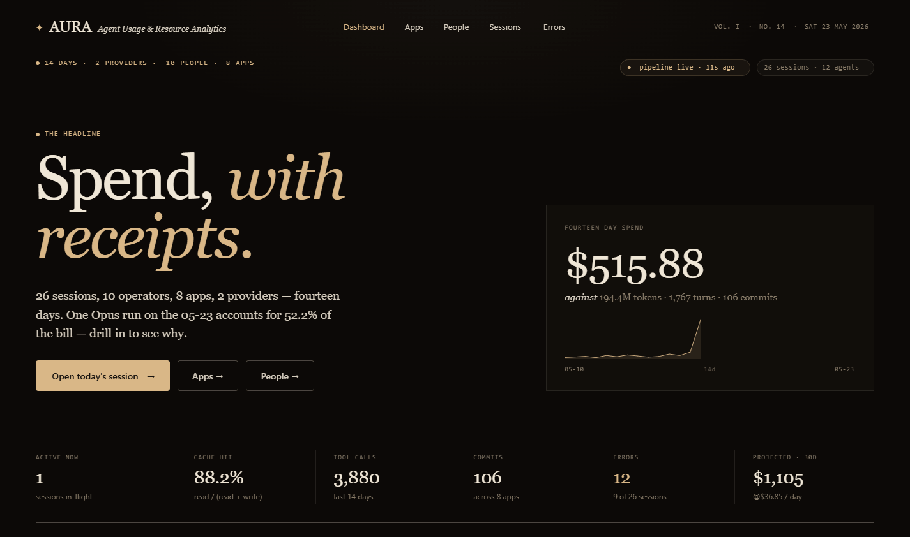
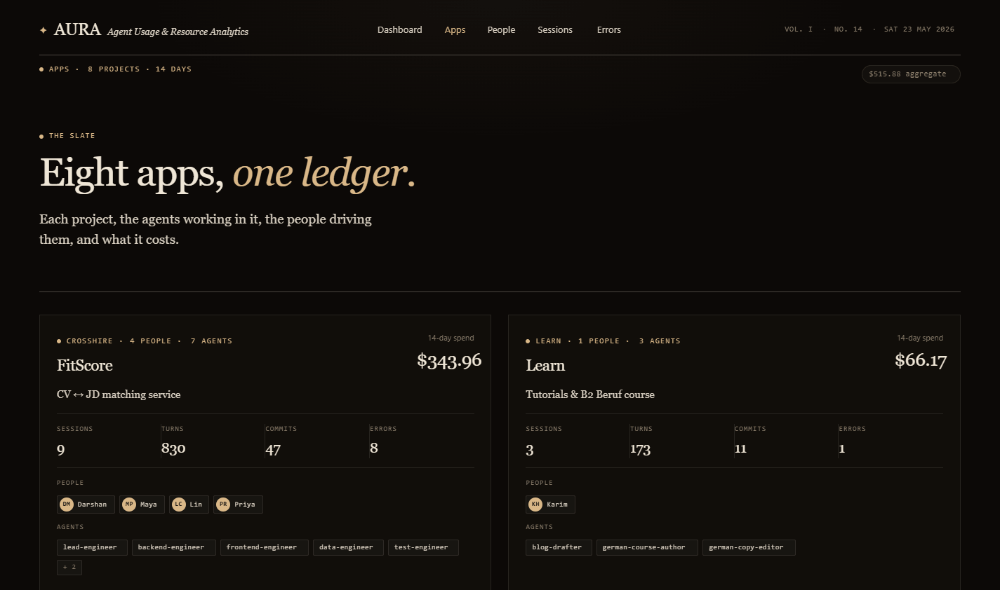
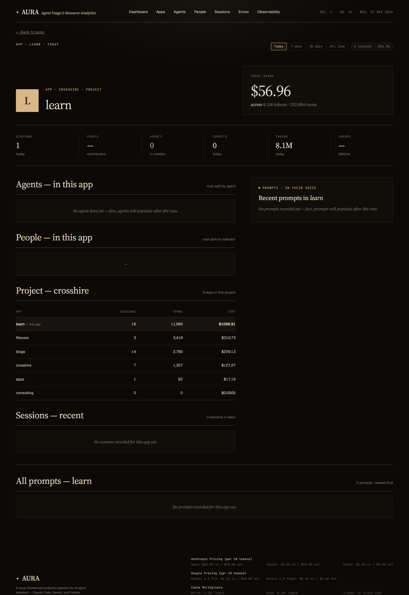
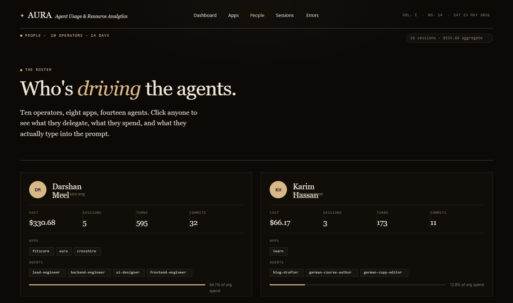
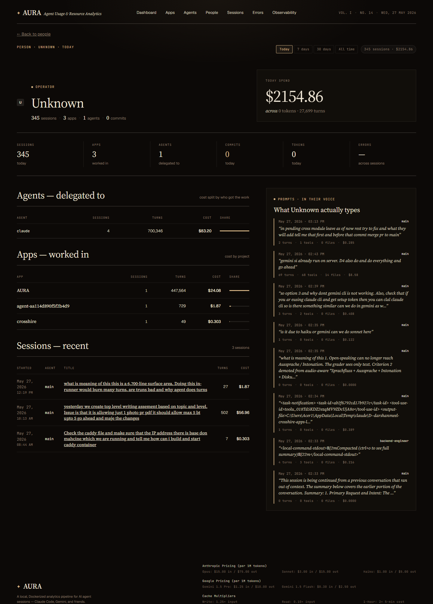
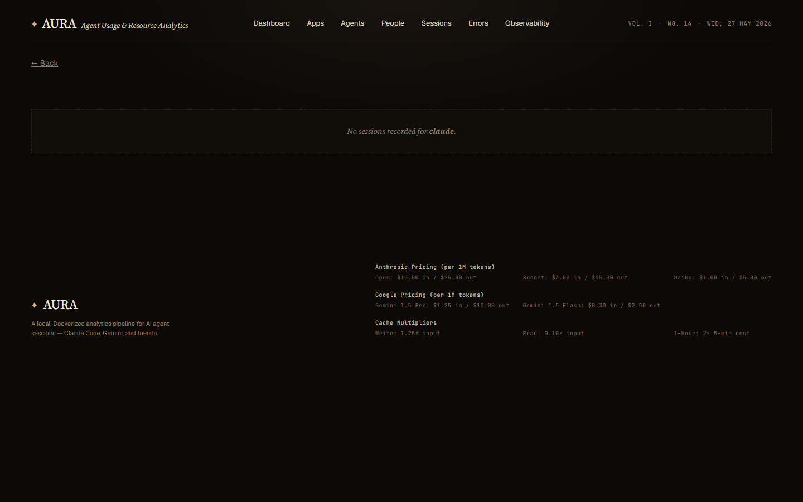
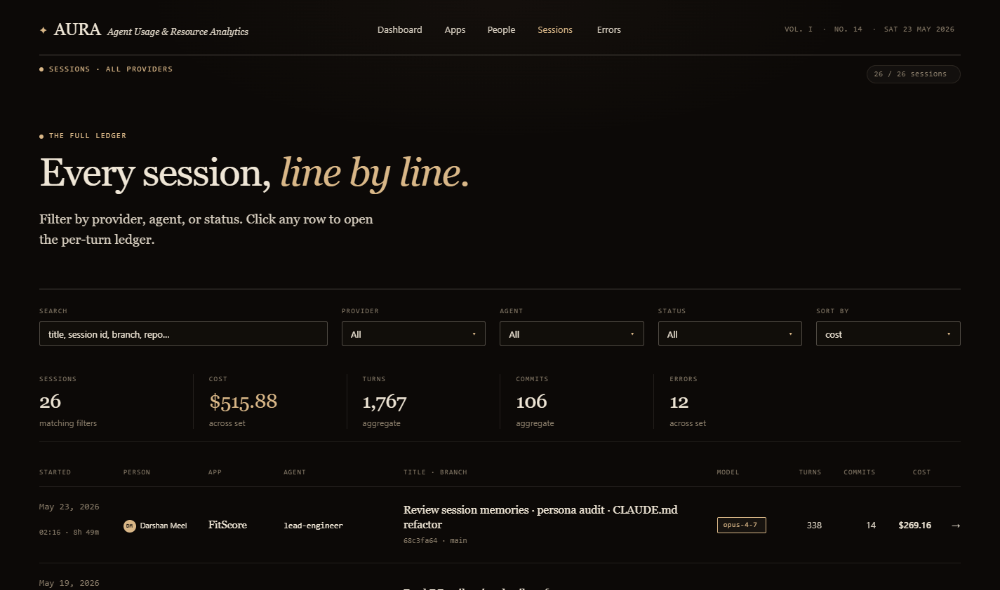
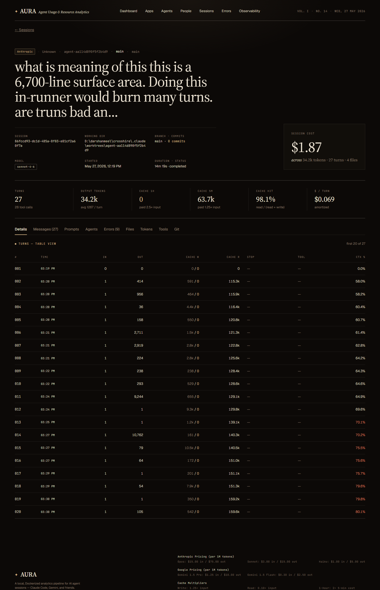
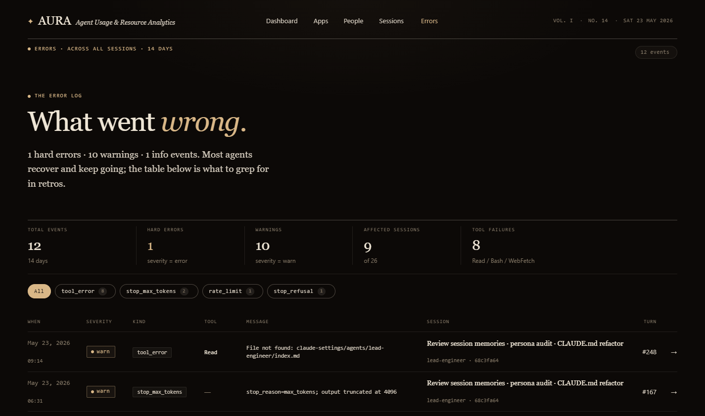

# AURA — Agent Usage & Resource Analytics

A local-first, Dockerized analytics platform for AI coding agent sessions (Claude Code today; Gemini, Codex, and friends on the roadmap). Aura watches your agent transcripts, transforms them through dbt, and surfaces cost, productivity, and behavioural signals through a Next.js dashboard. All data stays on your machine.

> *Spend, with receipts.*

---

## Why Aura

If you use Claude Code, Cursor, Aider, or any agentic coding assistant, you are already producing a goldmine of structured data on how you and your team think, debug, and ship. Aura turns that exhaust into a usable record:

- **Cost transparency** — every dollar spent, broken down by model, agent, project, person, and individual prompt
- **Operator visibility** — who is using which agent, what they ask for, and what gets delivered
- **Quality signals** — overkill detection (used Opus for a one-liner?), error rates per agent, cache hit rates, time-to-completion
- **Replay** — every prompt and response, tool call by tool call, with attribution back to the file paths that were edited

Designed for individuals who want introspection on their own AI usage, and for teams who want a shared, honest picture of agent ROI.

---

## Architecture

```
┌────────────────────┐    ┌─────────────────┐    ┌──────────────────┐
│  ~/.claude/        │───▶│  watcher (Py)   │───▶│  aura.duckdb     │
│  projects/*.jsonl  │    │  watchdog +     │    │  raw_events      │
│                    │    │  adapter        │    │  session_meta    │
└────────────────────┘    └─────────────────┘    └──────────────────┘
                                                          │
                                                          │ snapshot (2s)
                                                          ▼
                          ┌─────────────────┐    ┌──────────────────┐
                          │  dbt build      │◀───│  aura_read.      │
                          │  (every 5 min)  │    │  duckdb          │
                          └─────────────────┘    │  staging / int / │
                                  │              │  marts           │
                                  ▼              └──────────────────┘
                          ┌─────────────────┐             ▲
                          │  dim_sessions   │             │
                          │  fact_turns     │             │
                          │  fact_prompts   │             │
                          │  dim_apps       │             │
                          │  dim_people     │             │
                          │  dim_agents     │             │
                          │  ...            │             │
                          └─────────────────┘             │
                                                          │ READ ONLY
                                                          │
                          ┌─────────────────┐             │
                          │  Next.js        │─────────────┘
                          │  dashboard      │
                          │  localhost:3000 │
                          └─────────────────┘
```

| Surface | Language | Purpose |
|---|---|---|
| `watcher/` | Python 3.11 + watchdog + DuckDB | Tail JSONL logs, redact secrets, write `raw_events` |
| `dbt/` | SQL + dbt-duckdb | Staging → intermediate → marts: pricing, attribution, rollups |
| `frontend/` | Next.js 14 (App Router) + TypeScript + DuckDB node-api | Dashboard + per-entity profile pages |

---

## What you get on the dashboard

| Page | What it shows |
|---|---|
| **Dashboard** (`/`) | Hero "Spend, with receipts." + 14-day cost, KPI strip (active sessions, cache hit rate, tool calls, commits, errors, 30-day projection), daily spend chart, apps ledger, projects rollup, agents table (now with app/project context), files, errors, tool mix, providers, models, cache split, loudest prompt of the day |
| **Apps** (`/apps`) | Every app you've worked in — cost, sessions, turns, commits, agents in rotation |
| **App detail** (`/apps/[appId]`) | Agents in this app, **People in this app**, sibling apps in the project, recent sessions, full chronological prompt feed |
| **Agents** (`/agents`) | Every agent × app row (same agent name in different apps shows separately) — sortable by cost, sessions, turns |
| **Agent detail** (`/agents/[name]`) | **People delegating** to this agent, apps served, models routed to, recent sessions, top files touched, prompts directed at this agent |
| **People** (`/people`) | Rich operator cards: cost, sessions, turns, commits, apps chips, agents chips, % of org spend |
| **Person detail** (`/people/[personId]`) | Agents this person delegates to, apps they work in, recent sessions, **"What {name} actually types"** prompt log |
| **Sessions** (`/sessions`) | Filterable ledger of every session with title, model, turns, cost, person, agent |
| **Session detail** (`/sessions/[id]`) | Per-turn ledger with tabs for messages, prompts, agents, errors, files, tokens, tools, git |
| **Errors** (`/errors`) | Hard errors, warnings, tool failures across all sessions with filters by kind/tool/severity |

---

## Tech stack

- **Ingestion:** Python 3.11, `watchdog`, `duckdb` Python client
- **Storage:** DuckDB (local file, read replica for the frontend via atomic snapshot)
- **Transform:** dbt 1.x with `dbt-duckdb` adapter, staging/intermediate/marts pattern
- **Pricing:** SCD-style `model_pricing` seed (per-tenant overrides supported)
- **Frontend:** Next.js 14 App Router, TypeScript, server components reading DuckDB directly, Recharts for visualizations
- **Container:** Docker Compose, two services (`watcher`, `frontend`) sharing a Docker volume

---

## Quick start (Docker)

**Requirements:** Docker, Docker Compose, and an existing `~/.claude/projects/` directory with at least one session.

```bash
git clone https://github.com/<you>/AURA.git
cd AURA
docker-compose up --build
```

Then open `http://localhost:3000`.

The `watcher` container does an initial backfill of every existing `.jsonl` file, runs `dbt build` once, and then tails for new events. The frontend reads from a snapshot of the DuckDB file (refreshed every 2 seconds), so the dashboard never blocks ingestion.

Environment variables (all have sensible defaults):

| Variable | Default | What it does |
|---|---|---|
| `AURA_LOGS_DIR` | `/logs/claude` | Where to look for `.jsonl` files inside the watcher container |
| `AURA_DB_PATH` | `/data/aura.duckdb` | Write-side DuckDB file |
| `AURA_READ_DB_PATH` | `/data/aura_read.duckdb` | Read-side snapshot (consumed by frontend) |
| `AURA_SNAPSHOT_INTERVAL` | `2` | Seconds between snapshot refreshes |
| `AURA_DBT_RUN_INTERVAL_MINUTES` | `5` | How often `dbt build` runs |
| `CLAUDE_LOGS_DIR` | `~/.claude/projects` | Host-side path to mount into the watcher |
| `AURA_QUERY_TIMEOUT_MS` | `15000` | Maximum milliseconds a single DuckDB query may run before being aborted (frontend) |
| `AURA_REDACT_PAYLOAD` | `true` | Set to `false` to disable secret/base64 redaction in payload (raw JSONL passes through unchanged) |
| `AURA_MODEL_WINDOWS_JSON` | `{}` | Optional JSON object to override model context window sizes, e.g. `{"new-model-id":1000000}` |

---

## Local development (no Docker)

```bash
# 1. Watcher
cd watcher
pip install -e .
python -m aura_watcher

# 2. dbt (after watcher has written some data)
cd dbt
dbt deps
dbt seed
dbt build

# 3. Frontend
cd frontend
npm install
npm run dev   # localhost:3000
```

Set `AURA_DB_PATH` and `AURA_READ_DB_PATH` in your shell to point at the actual DuckDB files; otherwise the defaults assume Docker paths.

---

## Configuring people

By default, every session is attributed to the host OS user (`getpass.getuser()`). To make the People page meaningful with friendly display names, create `~/.aura/people.json`:

```json
{
  "darshan": { "name": "Darshan Singh", "role": "Founding engineer" },
  "alice":   { "name": "Alice Liu",     "role": "Designer" }
}
```

Keys are OS usernames; values flow into `session_meta` at ingestion time.

---

## Screenshots

### Dashboard
High-level cost, KPIs, providers, models, errors — everything at a glance.


### Apps & App profile
Card grid of every app, then a per-app rollup with agents, people, sibling apps, and a full prompt feed.



### People & Person profile
Rich operator cards on the list; a two-column profile with agents delegated to, apps worked in, and the operator's actual prompt log on the right.



### Agent profile
Who delegates to this agent, which apps it serves, which models it gets routed to, and the prompts directed at it.


### Sessions & Session detail
Filterable ledger of every session, then a per-turn breakdown of one session with tabs for messages, prompts, tools, files, errors, and git activity.



### Errors
Hard errors, warnings, and tool failures, filterable by kind and tool.


---

## Notable behaviour

- **Pricing is SCD-aware.** The `model_pricing` seed has `valid_from` / `valid_to` columns; cost calculation joins on the timestamp of the model call, so historical sessions stay correctly priced even when rates change.
- **Cost is calculated once.** `fact_turns.calculated_cost` is the single source of truth; every page that shows a cost number aggregates from there. Dashboards and per-page totals always match.
- **Cache hit rate uses the right denominator.** `cache_read / (cache_read + cache_write_5m + cache_write_1h)` — not `cache_read / input_tokens`.
- **Agents are tracked per app**, not just by name. `runner` in your Aura project and `runner` in another project show up as separate rows.
- **Overkill detection.** `fact_prompts` scores each external prompt on a complexity tier (S/M/L/XL by char count, tool calls, files edited) and compares it to the model tier (Haiku/Sonnet/Pro/Opus). If you used Opus to fix a typo, the prompt gets flagged.
- **Sidechain agent attribution.** When the main agent dispatches to a subagent via the `Task` tool, every event between dispatch and result is attributed to that subagent in `int_event_agent` and inherits into `dim_agents` / `fact_prompts`.

---

## How to Productionize for Multiple Users

To move Aura from a local single-user tool to a multi-user production environment:

1. **Centralized Log Ingestion.** Replace the local `~/.claude/projects` watch with a log-shipper (FluentBit, Promtail, or a custom agent) running on each user's machine, streaming `.jsonl` events to a centralized object store (S3) or queue (Kafka).
2. **Cloud Data Warehouse.** Migrate from local DuckDB to Snowflake, BigQuery, or MotherDuck. The dbt layer is portable; only the staging sources change.
3. **Hosted Dashboard.** Deploy the Next.js frontend to Vercel, AWS, or GCP. Add authentication (OAuth/SSO) and role-based access control. The frontend currently runs as server components — wire user identity into the read-path queries so people only see their own data unless they have a manager role.
4. **Scheduled Transformations.** Replace the embedded dbt worker loop with Airflow, Dagster, or dbt Cloud. Hourly rollups remain reasonable; the marts are designed to be fully rebuildable.

### Privacy for Multiple Users (Column Masking)

When rolling out to multiple users, it's critical to preserve privacy. **Before any data is shipped to a central server, message and prompt content will be masked so that only the individual user can see their own conversations — not other users, not managers, not admins.**

The following columns contain sensitive content and will be masked or hashed prior to central ingestion:

| Column | Location | Masking approach |
|---|---|---|
| `user_prompt` | `int_turns`, `fact_turns` | SHA-256 hash (content not recoverable) |
| `assistant_response` | `int_turns`, `fact_turns` | SHA-256 hash (content not recoverable) |
| `prompt_text_200` | `fact_prompts` | Masked / nulled out |
| `summary_200` | `fact_prompts` | Masked / nulled out |

**How it works:**
- The log-shipper (or a pre-ship dbt macro) replaces raw text in these columns with a cryptographic hash (SHA-256) before the data leaves the user's machine.
- All other columns — token counts, costs, tool names, timestamps, model IDs — travel unmasked and are safe to aggregate across users.
- A user viewing their own session detail page sees the full decrypted content sourced directly from their local DuckDB, not from the central copy.
- The central warehouse only ever receives hashed values, so even a compromised central store cannot reveal what any developer typed.

> **TODO (pre-central-deployment):** Implement column masking in `watcher/src/aura_watcher/redact.py` and/or a dbt pre-hook macro so that `user_prompt`, `assistant_response`, `prompt_text_200`, and `summary_200` are hashed/nulled before any outbound sync. See the column table above for target fields.

---

## Roadmap

- [ ] Gemini adapter (architecture is ready; the `model_pricing` seed already has Gemini rows)
- [ ] Codex / Aider adapters
- [ ] Column masking implementation (the privacy plumbing — see above)
- [ ] dbt schema tests (`not_null`, `unique`, `relationships`) for primary keys on every mart
- [ ] Multi-tenant auth — `tenant_id` is plumbed through the schema but always `'local'` today
- [ ] Anomaly detection: prompts that spike in cost, agents that suddenly start erroring out
- [ ] `aura.toml` config wiring (the file is defined but currently ignored; environment variables override everything)

---

## Documentation

- [docs/code-review.md](docs/code-review.md) — full codebase audit with prioritized improvement notes
- [docs/design-match-audit.md](docs/design-match-audit.md) — comparison between the original design mockup and the current implementation
- [docs/superpowers/specs/](docs/superpowers/specs/) — original spec documents for each major release

---

## License

MIT
