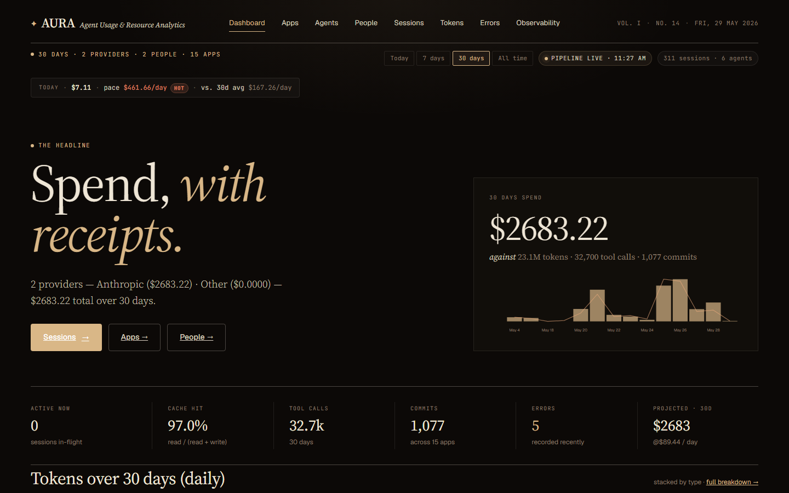
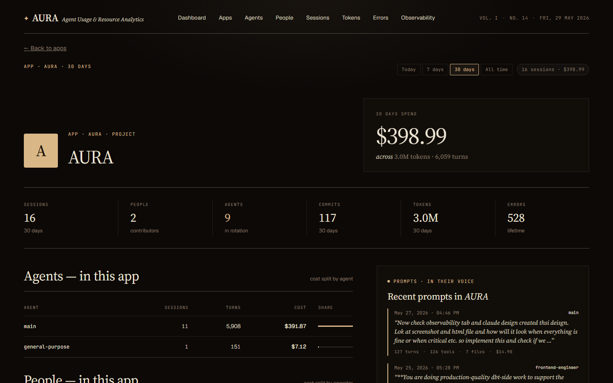
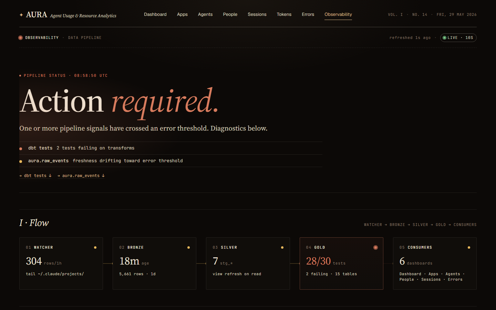

# Aura: Spend, with receipts

*Darshan Singh · 29 May 2026 · ~11 min read · Tooling / AI / Observability*

---

I ran one query against a month of my own Claude Code transcripts and learned
I'd spent **$2,666** in thirty days — 32,600 tool calls, 1,072 commits, a 97%
cache-hit rate, and a single agent quietly eating two-thirds of the bill. None
of that was visible the day before. It was sitting in JSONL files on my disk the
whole time, unread.

That gap — between *how much your AI coding agent is doing* and *what you can
actually see of it* — is the entire reason Aura exists.

This post explains what Aura is, why I built it, how it works under the hood,
and why I think anyone running an agentic coding assistant should be running
something like it.

---

## The problem: your agents keep a diary, and nobody reads it

If you use Claude Code, Cursor, Aider, or any agentic assistant, every session
you run is written to disk as a structured log. For Claude Code it's
`~/.claude/projects/**/*.jsonl` — one line per event: every prompt, every model
call with its exact token counts, every tool invocation, every file edit, every
error.

It is, genuinely, a goldmine. It records how you think, what you delegate, where
your agents fail, and precisely what each of those things costs. And almost
nobody looks at it, because:

- **It's unreadable.** Tens of thousands of nested JSON events per day.
- **There's no total.** Your provider bill is one number a month later, with no
  breakdown by project, by agent, by prompt.
- **There's no memory.** Once a session scrolls off your terminal, the reasoning
  and the receipts are gone unless you go spelunking in the raw files.

You're flying an increasingly expensive aircraft with the instrument panel
taped over. Aura un-tapes it.

---

## What Aura is

**Aura is a local-first analytics platform for AI-coding-agent sessions.** It
watches your transcripts, transforms them with dbt, and surfaces cost,
productivity, behavioural, and pipeline-health signals through a Next.js
dashboard. Everything runs in Docker on your own machine. No data leaves your
laptop.

The tagline is *"Spend, with receipts,"* and that's the design constraint, not
just a slogan: **every dollar Aura shows you is traceable back to the prompt,
the model call, and the file edit that produced it** — and every page that shows
a cost for a given time range reconciles to the same total. No drift between the
dashboard and the per-app breakdown and the per-person breakdown. One number,
provable from four directions.



Today it speaks fluent Claude Code. Gemini and Codex adapters are next — the
architecture was built for more than one provider from day one.

---

## Why I built it (and why a bill isn't enough)

The monthly invoice tells you *that* you spent money. It never tells you the
things you actually need to act on:

- **Which project burned the budget?** Aura splits every dollar by app, project,
  agent, person, and individual prompt.
- **Did you use a sledgehammer on a thumbtack?** Aura's *overkill detection*
  scores each prompt on complexity (characters, tool calls, files touched) and
  compares it to the model tier you used. Fixed a typo with Opus? It gets
  flagged.
- **Who's doing the work?** When your main agent dispatches a subagent via the
  `Task` tool, Aura attributes every event in that window to the *real*
  subagent — so `technical-writer`, `frontend-engineer`, and `code-reviewer`
  show up as distinct rows instead of collapsing into one anonymous `claude`.
- **Are the numbers even current?** A built-in Observability tab shows
  ingestion freshness, dbt run status, and watcher failures, so you always know
  whether what you're looking at is live or stale.

I wanted the honest picture — for myself as an individual, and for any team that
wants a shared, un-spun view of what their agents actually return for the money.

---

## How it works

Aura is deliberately boring on the inside. No Kafka, no managed warehouse, no
orchestrator. Three small, independent surfaces and a single file database.

```
~/.claude/projects/*.jsonl
        │
        ▼
   watcher (Python)         ──writes──▶   aura.duckdb   (the write DB)
   tail + parse + redact                       │
        │                                      │ snapshot every 30s (atomic)
        │ dbt every 5 min                      ▼
        ▼                              read/aura.duckdb  (the read snapshot)
   dbt models (DuckDB)                          │
   staging → intermediate → marts               ▼
                                        Next.js 14 dashboard  ·  localhost:3000
```

**1. The watcher (bronze).** A Python process tails the JSONL files using
polling (not inotify — it has to work on Windows and Docker bind-mounts where
filesystem events silently vanish). It parses each line, redacts secrets and
base64 blobs, and writes one row to a `raw_events` table with an
`INSERT … ON CONFLICT DO NOTHING` so re-runs never double-count. On startup it
backfills every existing file **newest-first**, so today's data lands on the
dashboard before the historical catch-up finishes.

**2. dbt (silver → gold).** Every five minutes — against whatever's in
`raw_events` *right now*, never blocking on backfill — dbt rebuilds a clean
medallion stack: staging views, intermediate models, and the marts the
dashboard reads (`fact_model_calls`, `fact_daily_spend`, `dim_sessions`,
`fact_prompts`, and friends). Cost is **anchored to the event timestamp, never
session-start**, so a session that began yesterday and ran into today gets its
tokens counted on the correct day. Pricing is SCD-aware: rates have
`valid_from`/`valid_to`, so historical sessions stay correctly priced even after
a price change.

**3. The snapshot trick.** DuckDB allows one writer at a time. Aura sidesteps
the lock the easy way — *never have two readers fighting the writer.* The
watcher atomically copies the write DB to a read-only snapshot every 30 seconds;
the frontend only ever queries the snapshot. The frontend's connection layer
watches the file's inode and transparently reopens when the snapshot is
replaced, so it never serves stale data after a refresh. The cost is up to 30
seconds of lag. The win is zero connection contention and a dashboard that never
locks up the ingester.

**4. The frontend (Next.js 14, App Router).** Server components read DuckDB
directly — almost no API layer. Charts are hand-rolled SVG (no charting library
to fight). One time-range model (`today / 7d / 30d / all`) flows through every
page, and ranged queries hit a single pre-aggregated `int_entity_spend` mart so
the totals reconcile everywhere by construction.

The whole thing is designed to run a 200k+ event analytics stack on one laptop
without an orchestrator — and it does.

---

## What you actually get

A quick tour of the surfaces. (All screenshots are the real dashboard against my
own month of transcripts.)

- **Dashboard** — the headline spend, a KPI strip (cache hit rate, tool calls,
  commits, errors, 30-day projection), the daily spend chart, and ledgers for
  apps, projects, and agents.
- **Sessions** — a filterable ledger of every session: title, model, turns,
  cost, person, agent, plus 🧩 skills and ⚡ MCP counts. Click one and you land
  on the per-turn **Details** view — the full deep-dive, tab by tab.

  

- **Apps / Agents / People** — every entity gets a roster *and* a profile page.
  The app page shows the agents in rotation, the people who worked in it, sibling
  apps in the project, and a live prompt feed. The agent page shows who
  delegates to it and the files it touches. The people page shows real operator
  cards with their share of org spend — and *"What {name} actually types."*

  

- **Tokens** — spend broken out by token type, provider, model, and agent, with
  a distinct palette per type so cache reads don't blur into output.
- **Errors** — hard errors, warnings, and tool failures across every session,
  filterable by kind, tool, and severity.
- **Observability** — the pipeline's own health: a derived verdict, a
  Watcher → Bronze → Silver → Gold → Consumers flow strip, medallion-layer
  freshness, source-freshness checks, dbt test results, and the live watcher
  error feed. It polls every 10 seconds.

  

---

## Why you should use it

**If you're an individual:** you get introspection on your own habits. You'll
find out which projects you over-spend on, which prompts you route to a model
that's three tiers too big, and where your agents quietly burn tokens retrying
the same failing tool. The first time overkill detection flags a $4 typo fix,
it pays for the setup.

**If you're a team:** you get a shared, honest picture of agent ROI. Cost by
person and by project, attribution down to the real subagent, error rates per
agent, and a pipeline-health tab so nobody argues about whether the numbers are
fresh. Because every cost reconciles to a single source, the dashboard total and
the per-person sum are *the same number* — there's nothing to litigate.

**If you care about privacy:** everything is local-first. Nothing is shipped
anywhere. And the path to multi-user is designed around column masking from the
start — prompt and response text gets hashed before it would ever leave a
machine, so a central store can aggregate cost and token counts without ever
seeing what anyone typed.

---

## The honest part

Aura is a tool I built for myself first, so the edges are honest:

- It reads **Claude Code** today. Gemini and Codex are on the roadmap (the
  pricing seed already has Gemini rows; only the adapter is missing).
- Sessions launched as **top-level CLI agents** (`claude --agent <name>`) roll
  up under `main`, because that identity lives in a system prompt, not a
  structured field. Delegated subagents (via `Task`) *are* attributed correctly.
- Every dbt model is a full rebuild (`table`/`view`), not incremental. At one
  developer's scale — 100k–500k events — a rebuild every five minutes finishes
  in under a minute. Past ~1M rows you'll want incremental facts; the plan for
  that is written down, not yet shipped.

These are deliberate "simplest thing that works" choices, not oversights. The
roadmap is in the repo.

---

## Getting started

You need Docker, Docker Compose, and a `~/.claude/projects/` directory with at
least one session.

```bash
git clone https://github.com/darshanmeel/AURA.git
cd AURA
docker-compose up --build
# then open http://localhost:3000
```

On first boot the watcher starts its snapshot and dbt workers immediately,
backfills your existing transcripts newest-first, and hands off to the live
poller. The dashboard populates while the historical catch-up is still running.

> One footnote from experience: the dashboard defaults to the **today** range.
> If your most recent sessions were yesterday, "today" will look empty — switch
> to `7d` or `30d` and the receipts appear. Everything filters on the event
> date, so an empty "today" means exactly that, not a broken pipeline.

---

## The point

Your agents are already writing everything down. Aura just reads it back to you —
with the totals, the attribution, and the receipts that the raw logs never quite
hand over on their own. Spend, with receipts.

The repo is open. Point it at your transcripts and see what a month of your own
agent usage actually looks like. I suspect, like me, you'll be surprised by at
least one number.

---

*Aura is MIT-licensed and runs entirely on your machine. Architecture
deep-dive: [HOW-IT-WORKS.md](https://github.com/darshanmeel/AURA/blob/main/docs/screens/HOW-IT-WORKS.md). Operator's guide:
[OVERVIEW.md](https://github.com/darshanmeel/AURA/blob/main/docs/screens/OVERVIEW.md).*
