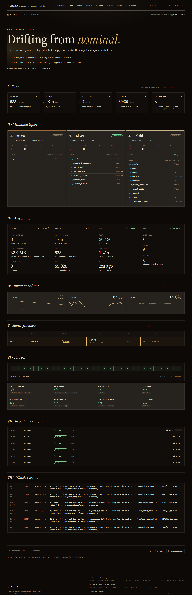
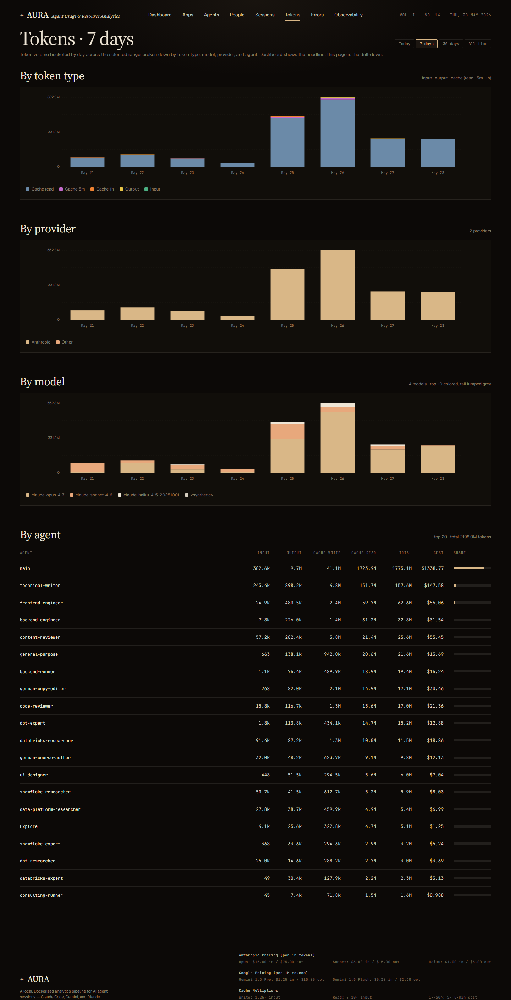
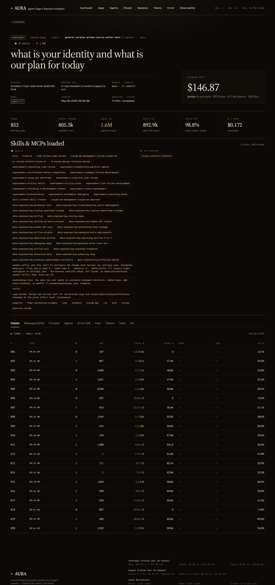
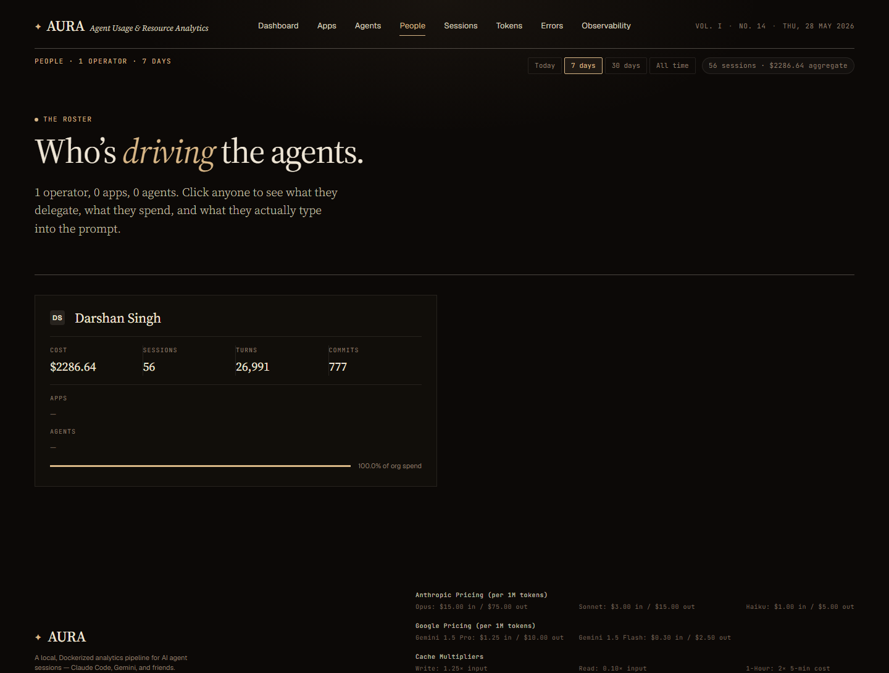
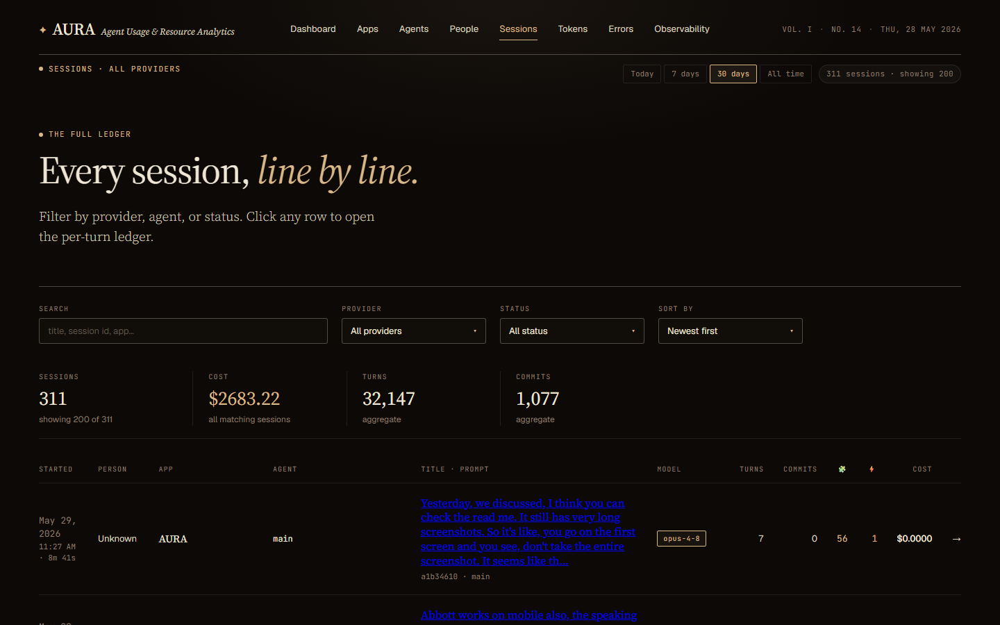

# AURA — How It Works

A deep-dive into the AURA pipeline: what each surface does, how they
co-operate, and the design decisions that make it possible to run a 200k+
event analytics stack on one laptop without an orchestrator.

If you want the bird's-eye view, read [OVERVIEW.md](./OVERVIEW.md) first.
If you want a screen tour, browse the per-screen `.md` files in this
directory.

---

## 0 — The grand strategy


The single summary screen above is the *output* of the entire pipeline.
Everything in this document describes how that page gets populated.

**Local-first, batch-shaped, single-process per surface.** Everything runs in
Docker on the developer's machine. No managed cloud, no Kafka, no separate
orchestrator. Three things keep it sane at this scale:

1. **DuckDB does the heavy lifting.** A single file holds 100k+ events;
   queries that would need a warehouse elsewhere finish in milliseconds.
2. **The watcher is the only writer.** Everyone else (frontend, dbt) reads.
   This sidesteps DuckDB's "one writer at a time" lock the easy way:
   never have two.
3. **Snapshots, not concurrency.** The watcher copies the write DB to a
   read-only `read/aura.duckdb` snapshot every 30 seconds. The frontend
   queries that, never the live writer. The cost is up to 30s of staleness;
   the win is zero connection contention.

---

## 1 — The watcher (bronze)

**File:** `watcher/src/aura_watcher/main.py` and friends.

### What it does

- Watches `~/.claude/projects/**/*.jsonl` with `watchdog`'s `PollingObserver`
  (inotify is unreliable on Windows bind-mounts).
- For each line written, calls `ClaudeAdapter.parse_line()` and inserts one
  row into `raw_events` via `INSERT … ON CONFLICT DO NOTHING` (the `(tenant,
  uuid)` primary key dedupes on retry).
- Also extracts skill listings (`invoked_skills` attachments → `raw_session_skills`)
  and MCP server registrations (`mcp_instructions_delta` → `raw_session_mcps`).
- Writes `session_meta` (person, title, ingested_at) the first time it sees
  a session.

### Three workers, one lock

The watcher runs three things concurrently:

```
            ┌──────────────────────┐
            │  process_file        │  reads JSONL lines, parses, inserts
            └──────────┬───────────┘
                       │
            ┌──────────┴───────────┐
            │  _snapshot_lock      │  threading.Lock — serialises writers
            └──────────┬───────────┘
                       │
   ┌───────────────────┼───────────────────┐
   ▼                                       ▼
┌─────────────────┐                  ┌─────────────────┐
│ snapshot_worker │                  │ dbt_worker      │
│ every 30s       │                  │ every 5 min     │
│ copies write→   │                  │ runs dbt seed / │
│ read DB         │                  │ run / freshness │
│ with FORCE      │                  │ / test inside   │
│ CHECKPOINT      │                  │ the watcher     │
└─────────────────┘                  └─────────────────┘
```

The lock makes the three writers mutually exclusive against the same
DuckDB file. dbt holds it while it runs (~30–60 s); process_file pauses
during those windows but never drops events because `process_file` reads
the JSONL outside the lock and only acquires it for the INSERT.

The state of these workers is visible live on the Observability page —
verdict, medallion freshness, dbt run history, watcher errors:



### Initial backfill

On startup the watcher iterates every `.jsonl` file once, newest first.
This re-emits events (no-ops via ON CONFLICT) so a fresh checkpoint table
still ingests everything. The `session_meta` backfill uses a separate
helper `backfill_session_meta()` that holds the lock for the entire scan
with a single connection (the previous per-file approach hit "Conflicting
lock" errors for ~95% of sessions because dbt cycles starved it).

### The `agent` column trap

Every row in `raw_events` carries `agent: 'claude'` (a placeholder from
the adapter). This was originally meant as a "provider" tag but ended up
flowing into `fact_model_calls.agent` and from there into every roll-up
— so the whole /agents page collapsed into one row.

The fix isn't in the watcher (the placeholder is fine as-is for raw
ingest). It's in `fact_model_calls.sql`, which LEFT-JOINs
`int_event_agent.agent_resolved` and overrides the column.

### Identity

`session_meta.person_id` resolves to either `AURA_DEFAULT_PERSON_ID` env
var (set in docker-compose to `darshan`) or `getpass.getuser()` (which is
`root` inside the container). `person_name` resolves similarly from
`AURA_DEFAULT_PERSON_NAME` or `~/.aura/people.json`. After the recent
fix, 311 / 349 sessions resolve to "Darshan Singh"; the remaining 38
have orphan JSONL files no longer on disk.

---

## 2 — dbt (silver → gold)

**Directory:** `dbt/`. **Runs:** every 5 minutes inside the watcher.

### Layers

| Layer | Materialisation | Examples |
|---|---|---|
| `stg_*` | view | per-event-type filters on `raw_events` |
| `int_*` | table | `int_turns`, `int_event_agent`, `int_app_cwd_lookup`, `int_entity_spend` |
| `dim_*` | table | `dim_sessions`, `dim_apps`, `dim_agents`, `dim_people`, `dim_projects` |
| `fact_*` | table | `fact_turns`, `fact_model_calls`, `fact_tool_executions`, `fact_prompts`, `fact_errors`, `fact_daily_spend`, `fact_hourly_activity`, `fact_session_files`, `fact_git_commands`, `fact_spend_pace` |

### The three load-bearing intermediate models

- **`int_turns`** — a "turn" = one user-prompt → assistant-reply pair.
  Joins `stg_events` user-to-assistant. Used by `fact_turns`,
  `dim_sessions`, and the session-detail Messages tab.
- **`int_event_agent`** — maps every event UUID to a resolved subagent
  name. Walks `stg_tool_calls` looking for Task/Agent dispatches with a
  `subagent_type` field, then attributes any `is_sidechain` event whose
  timestamp falls inside the dispatch window. Default: `'main'`.
- **`int_entity_spend`** — universal cost pivot. Grain:
  `(tenant_id, entity_type, entity_id, date)` where `entity_type ∈
  {app, project, agent, person}`. Every ranged "top-N" query in the
  dashboard hits this one mart for speed.

### Why `dbt run`, not `dbt build`

`dbt build` skips downstream models when a data-quality test fails, which
would leave the dashboard stale on a single bad row. We run `dbt run`
unconditionally and execute `dbt test` separately, logging failures but
never blocking materialisation.

### Run results

After each cycle, `target/run_results.json` is copied to
`/data/artifacts/run_results.json` for the Observability page, and
timestamped copies land in `/data/artifacts/history/` (last 20 retained).

---

## 3 — The snapshot worker

**Function:** `snapshot_worker()` in `main.py`.

Every 30 seconds (`AURA_SNAPSHOT_INTERVAL=30`), it:

1. Acquires `_snapshot_lock`.
2. Calls `take_snapshot()` which does `FORCE CHECKPOINT` on the source
   then `shutil.copy()` to `/data/read/aura.duckdb`.
3. Releases.

The interval used to be 2 s. We bumped it to 30 s because the frontend's
inode-aware connection cache (`db.ts`) was being invalidated mid-request
— a cold connection took ~30 s while the warm one would have been < 1 s.

The trade-off: dashboard data lags the watcher by up to 30 s. For
analytics this is fine. For Observability we live-poll the watcher
process directly (10 s).

---

## 4 — The frontend (Next.js 14 App Router)

**Directory:** `frontend/`. **Image:** standalone Next.js output.

### Data access

- **No API layer for read paths.** Server components import functions
  from `lib/queries/*.ts` directly, which connect to the read snapshot
  via a small inode-aware DuckDB connection cache (`lib/db.ts`).
- **Inode tracking** matters because the snapshot worker REPLACES the
  file (not patches it), so the underlying inode changes every 30 s. The
  cache reopens on inode mismatch.
- **One API endpoint exists**: `/api/observability` for the 10 s
  live-poll loop. Returns watcher heartbeat + medallion freshness +
  recent errors.

### Range pattern

`parseRange(searchParams.range)` → `rangeSince(range)` → ISO date string
or `null`. Each query function takes `(filters, since)` and branches:

- `since === null` → read from dim_*/fact_* marts (lifetime, richest)
- otherwise → read from `int_entity_spend` (pre-aggregated, ranged)

### SVG charts, no library

Every chart (`TokenSeriesChart`, `DailyChart`, `ActivityHeatmap`, KPI
sparklines) is hand-rolled SVG. Reasons: bundle size, no client/server
boundary issues, and the design language is unusual enough that a
library would fight us.

The token chart's recent fixes:

- Dropped `'use client'` so `pivotByDim` and `TOKEN_TYPE_SEGMENTS` (both
  non-component exports) can be called from server components without
  Next.js wrapping them in client-reference proxies.
- Palette is now distinct colours (teal / gold / orange / violet / slate),
  not all-cream theme vars that vanished against the paper background.

### Session detail tabs

Client-side state in `components/SessionTabs.tsx` (`useState('details')`).
Each tab fetches its own slice on-demand if it's a heavy one — Prompts in
particular goes through `/api/sessions/[id]/prompts-enriched` because the
inequality-join window walked `fact_tool_executions × fact_turns` per
prompt and was adding 10–30 s to first paint on long sessions.

---

## 5 — How agent attribution actually works

This was the messiest part to get right. The full chain:

```
raw_events.agent  (= 'claude' literal — placeholder)
       │
       ▼  stg_assistant_messages reads through
stg_assistant_messages.agent  (= 'claude' still)
       │
       ▼  fact_model_calls.sql OVERRIDES this column
fact_model_calls.agent  = COALESCE(int_event_agent.agent_resolved, 'main')
       │
       ▼
int_entity_spend (agent grain), dim_agents, /agents, /tokens by agent
```

`int_event_agent.agent_resolved` is computed from Task/Agent tool
dispatches with a `subagent_type` argument. For every dispatch, the
model identifies the subagent_type (e.g. "technical-writer"), the
dispatch+result timestamps define a window, and every `is_sidechain=true`
event in that window inherits the name. Non-sidechain events and
sidechain events outside any window default to `'main'`.

This catches **delegated** subagents (Task tool invocation). It does
**not** catch **top-level CLI launches** like `claude --agent learn-runner`
because the agent identity in that case lives only in the system prompt
loaded from `~/.claude/agents/learn-runner.md` — it isn't a structured
JSONL field. Those sessions roll up under `main`. The /agents page has a
footnote saying so:


Drilling into one subagent gives full session counts + skills/MCPs it
loaded (via the `int_event_agent` CTE described below):


The Tokens drill-down also pivots `fact_model_calls.agent` after the
override, so the by-agent table actually breaks out real subagent share:



---

## 6 — How skills + MCPs propagate

Watcher parses two attachment event types:

| Attachment type | Watcher function | Bronze table |
|---|---|---|
| `invoked_skills` | `parse_skills()` (in `adapters/claude.py`) | `raw_session_skills` |
| `mcp_instructions_delta` | `parse_mcp_servers()` | `raw_session_mcps` |

The original parser looked for `skill_listing` and `skills` types and
returned nothing — Claude Code actually emits `invoked_skills` with a
`skills: [{name, path, content}]` array. Fixed; backfill repopulates.

`dim_sessions` exposes `skill_count`, `skills_loaded[]`, `mcp_count`,
`mcp_servers[]` via two CTEs (`skills_per_session`, `mcps_per_session`).
Frontend uses those directly for the session masthead + chip list.

For app/agent surface, ad-hoc queries (`getAppSkills`, `getAgentSkills`,
…) join `raw_session_skills × dim_sessions` with the right scoping:

- App: `JOIN dim_apps ON cwd` (skills used in this app's sessions)
- Agent: `JOIN int_event_agent ON session_id WHERE agent_resolved = ?`
  (skills loaded in any session where the agent had at least one event)
  — NOT `dim_sessions.agent = ?` because that's the mode, which is `'main'`
  for 87% of sessions and would miss almost every real subagent.

The session detail page renders these as a chip list above the tabs
(visible names, not just hover):



The app detail page has the same panel scoped to one app's sessions:


---

## 7 — How the People surface actually populates

This was the second messiest fix. Three bugs stacked:

1. The watcher hardcoded `person_id = getpass.getuser()`, which returns
   `'root'` inside Docker.
2. The watcher derived `session_id` as `os.path.basename(os.path.dirname(file))`
   — but the JSONL layout is `/logs/claude/<project_dir>/<session_id>.jsonl`,
   so this returned the project dir, not the session UUID. Result: 19
   session_meta rows for 349 sessions, all keyed on project dirs that
   never JOINed to anything in dim_sessions.
3. The backfill loop opened a fresh DuckDB connection per file inside the
   lock window, so ~327 of 349 attempts failed with "Conflicting lock"
   under concurrent dbt cycles.

Fixes shipped in `session_meta.py`:

- `os.path.splitext(os.path.basename(f))[0]` to extract the real session_id.
- `AURA_DEFAULT_PERSON_ID` / `AURA_DEFAULT_PERSON_NAME` env vars in
  `docker-compose.yml` override the container's `root` identity.
- `backfill_session_meta(writer, files, lock)` holds the lock once and
  reuses a single connection for the whole scan.

After running once: 978 session_meta rows on disk, 311 / 349 dim_sessions
resolve to "Darshan Singh", 38 remain "Unknown" (orphan sessions whose
JSONL is no longer in `~/.claude/projects/`).



The sessions list also exposes the resolved person, plus the new 🧩 /
⚡ count columns and multi-agent display per row:



---

## 8 — Failure modes we've actually seen

| Failure | Symptom | Recovery |
|---|---|---|
| Read DB mid-copy corruption | Every dashboard query 500s with "Corrupt database file" | Stop watcher; FORCE CHECKPOINT write DB; `shutil.copy` to read DB; restart watcher; recreate frontend (inode cache rotates) |
| Build cache holds stale image | `docker compose up --build` reports success but containers are minutes old | `docker compose build --no-cache <svc>` |
| Watcher backfill starved by dbt | "Backfill progress" lines stop printing for minutes | Expected — dbt holds the lock for ~30–60 s per cycle. With 980 files this can take 10+ minutes total |
| `pip install` flakes during docker build | Build fails on watcher target | Re-run; the wheel cache will hit on retry |
| Frontend bails to client-side rendering | `<template data-dgst="BAILOUT_TO_CLIENT_SIDE_RENDERING">` in HTML | Expected for pages that use hooks (`/sessions` filter state). curl can't see the content; the browser will |
| TypeScript: `for…of` on Set/Map iterators | Build fails on `pivotByDim` | Use `Array.from()` — tsconfig target doesn't allow direct iteration |

---

## 9 — File map

```
watcher/src/aura_watcher/
  main.py                 # entry, observers, workers
  adapters/claude.py      # JSONL → row schema
  duckdb_writer.py        # all CREATE TABLE + INSERT
  checkpoint.py           # per-file byte_offset cursors
  snapshot.py             # FORCE CHECKPOINT + copy
  session_meta.py         # person, title, bulk backfill

dbt/
  models/
    staging/    stg_events.sql, stg_assistant_messages.sql, stg_tool_calls.sql, …
    intermediate/ int_turns.sql, int_event_agent.sql, int_entity_spend.sql, int_app_cwd_lookup.sql
    marts/      dim_sessions.sql, dim_apps.sql, dim_agents.sql, dim_people.sql, dim_projects.sql,
                fact_turns.sql, fact_model_calls.sql, fact_prompts.sql, fact_tool_executions.sql,
                fact_errors.sql, fact_daily_spend.sql, fact_hourly_activity.sql,
                fact_session_files.sql, fact_git_commands.sql, fact_spend_pace.sql
  seeds/model_pricing.csv

frontend/
  app/
    page.tsx              # dashboard
    sessions/page.tsx     # list
    sessions/[sessionId]/page.tsx
    apps/page.tsx
    apps/[appId]/page.tsx
    agents/page.tsx
    agents/[name]/page.tsx
    people/page.tsx
    people/[personId]/page.tsx
    errors/page.tsx
    observability/{page.tsx, PipelineLive.tsx}
    tokens/page.tsx
    api/observability/route.ts   # the only API endpoint
  lib/
    db.ts                 # inode-aware DuckDB connection cache
    queries/              # one file per surface
    range.ts              # range parser
    fmt.ts                # display formatters
  components/
    atoms.tsx             # Eyebrow, Rule, AgentLink, ModelPill, …
    SessionTabs.tsx       # session detail tabs (client component)
    TokenSeriesChart.tsx  # stacked bar chart (server component, SVG only)
    PipelineLive.tsx      # observability live polling
```

---

## 10 — What's not here yet

Open follow-ups that future-me will want to know about:

- **Top-level CLI agent attribution.** Sessions launched with
  `claude --agent <name>` collapse into `main`. Would need heuristics
  on agent .md files or first-message scraping; explicitly deferred (see
  agents page footnote).
- **dbt incremental materialisation.** Every model is currently
  `table` or `view`. At ~200k events we're fine; if `raw_events` grows
  past a million we'll want `incremental` for `fact_*` rebuilds.
- **Multi-tenant.** Everything carries a `tenant_id` column with default
  `'local'`. Nothing else uses it yet.
- **Gemini / Codex adapters.** The architecture supports multiple
  providers (model_pricing.csv has rows for Gemini already) but only
  Claude JSONL is parsed today.

---

## Cross-references

- [Screen index (README)](./README.md)
- [Operator's overview](./OVERVIEW.md)
- [Repo CLAUDE.md](../../CLAUDE.md) — agent routing + cordial-mode policy
- [Per-screen docs](.) — 13 files
