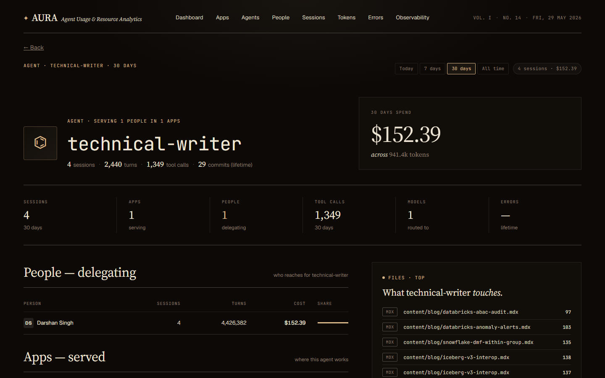
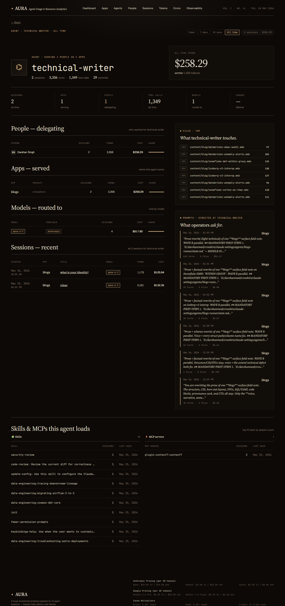

# Agent detail — Aura

**URL:** `/agents/<name>`  
**Sample:** `technical-writer` (top subagent by cost)  
**Primary range:** 7d  
**Variants:** all-time

## What this screen shows

Deep-dive into one Claude Code subagent. Shows which sessions used it, the cost it drove, what apps and projects it serves, which users delegate to it, and the files it touches. Answers: "Is this subagent being overused? Which human operators rely on it? What models does it call?"

## Layout & components

**Masthead strap** — agent name, time range selector, session count, total spend  
**Profile head** — agent glyph, name (monospace), meta summary (sessions / turns / tool calls / commits), hero stat (spend + token count)  
**6-stat strip** — Sessions, Apps, People, Tool calls, Models, Errors  
**People section** — who delegates to this agent; table shows person, session count, turn count, cost, cost share bar  
**Apps served** — which projects/apps this agent works in; table shows app ID, project ID, session count, turn count, cost, share bar  
**Models routed to** — which Claude versions and providers this agent calls; table shows model, provider tag, session count, cost, share bar  
**Recent sessions** — last N sessions for this agent; table shows start time, app, title, model, turn count, cost  
**Side panels** — top files touched (with file kind tags), recent prompts directed at this agent (snippet + turn/file/cost rollup)  
**Skills & MCPs** — top 10 skills and top 10 MCP servers this agent loaded across its sessions; tables show skill/MCP name, session count, last used timestamp

## Data sources

| Component | Query | Mart |
|---|---|---|
| Agent profile | `getAgent(name)` | `dim_agents` + `dim_sessions` (commits) |
| People delegating | `getAgentPeople(name, since)` | `dim_sessions` (lifetime) or `fact_model_calls` + `dim_sessions` (range) |
| Apps served | `getAgentApps(name, since)` | `dim_agents` (lifetime) or `fact_model_calls` + `dim_sessions` (range) |
| Models routed | `getAgentModels(name, since)` | `fact_turns` + `int_event_agent` |
| Recent sessions | `getAgentSessions(name, limit, since)` | `dim_sessions` + `dim_apps` |
| Files touched | `getAgentFiles(name, limit, since)` | `fact_session_files` + `dim_sessions` |
| Prompts | `getAgentPrompts(name, limit, since)` | `fact_prompts` |
| Range KPIs | `getAgentRangeAggregates(name, since)` | `int_entity_spend` + `dim_sessions` (tool_calls) |
| Skills (new) | `getAgentSkills(name, since)` | `raw_session_skills` × `int_event_agent` (CTE) × `dim_sessions` |
| MCPs (new) | `getAgentMcps(name, since)` | `raw_session_mcps` × `int_event_agent` (CTE) × `dim_sessions` |

## How to read it

- **Cost is per-agent, not per-app.** When the same agent appears across multiple projects, that cost sums at the agent level.
- **Agent name resolution.** Cost is attributed via `int_event_agent.agent_resolved` at the event level. The "main" agent rows represent the orchestrator; subagent rows show delegated work.
- **Range filtering.** 7d/30d/all-time uses `int_entity_spend` (pre-aggregated date grain) for fast header KPIs; session/file/prompt details filter on `start_ts` / `ts` directly.
- **Tool calls on range filter.** `int_entity_spend.total_tool_calls` is hardcoded to 0; the page fetches real counts from `dim_sessions.tools_used` grouped by date.
- **Commits are lifetime.** The "commits" stat shows all commits across history, not filtered by range—it's a proxy for agent maturity.
- **Skills & MCPs query uses int_event_agent.agent_resolved** — finds every session the agent participated in (not just sessions where it was the mode). CTEs ensure the agent's true session set is used for counting.

## Edge cases & empty states

- **Agent not found:** Shows "No sessions recorded for <name>." if the agent has never appeared in a session.
- **Person data missing:** Shows "No people data yet — dim_sessions needs person_id populated." if person IDs are not set.
- **App data missing:** Shows "No app data yet — dim_agents will populate after dbt runs." if the agent × app relationship is not yet computed.
- **Model data missing:** Shows "No model data yet — int_event_agent / fact_turns will populate after dbt runs."
- **Files / prompts empty:** If the agent touched no files or received no directed prompts, those panels are hidden or show empty state text.

## Related screens

- [Agents list](./agents-list.md) — all agents sorted by cost
- [Session detail](./session-detail.md) — deep-dive into one session; includes Agents tab showing which subagents ran

## Screenshots

- 7d: 
- All: 
