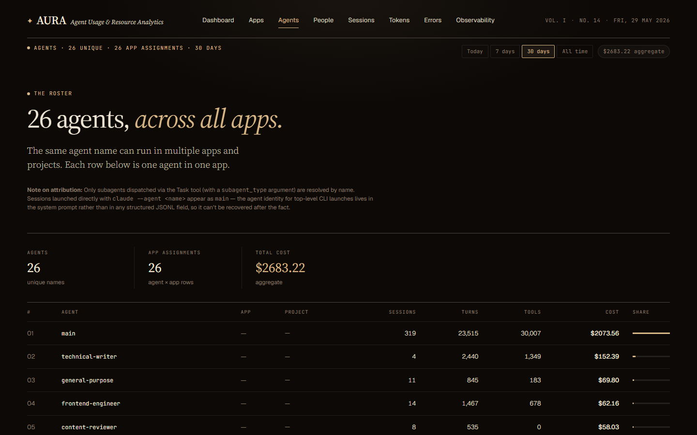
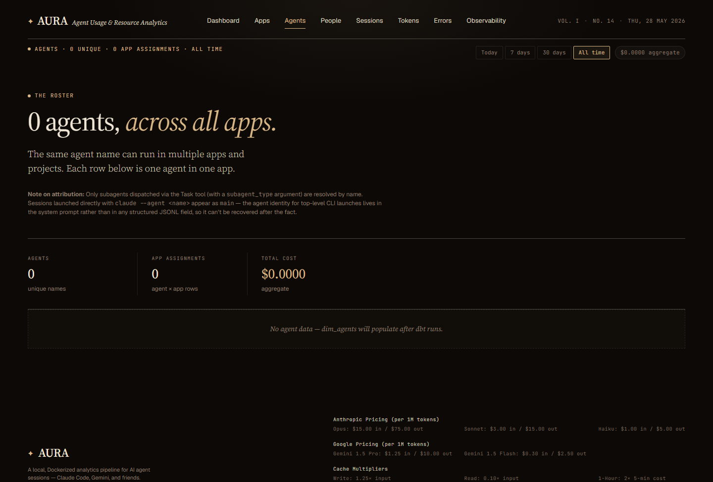

# Agents — list view

**URL:** `/agents`  
**Primary range:** 7d  
**Variants:** all-time

## What this screen shows

Roster of subagents with real attribution. Shows each agent name, its app context, session counts, tool usage, cost, and spend share. Subagent identity is resolved from JSONL `subagent_type` field; top-level CLI launches (which lack structured identity) aggregate under `main`.

## Layout & components

- **Range filter** — today, 7d, 30d, all-time
- **KPI strip** — unique agent names, app assignments, total cost aggregate
- **Attribution footnote** — explains `main` bucket and resolver limitation (top-level CLI agents like `claude --agent learn-runner` can't be detected from JSONL alone)
- **Agents ledger** — rank, name, app, project, sessions, turns, tools, cost, share %

## Data sources

| Component | Query | Mart |
|---|---|---|
| Agents list | `getTopAgents` (lifetime) or `int_entity_spend` (ranged) | `dim_agents`, `int_entity_spend` |

## How to read it

- **'main'** is the orchestrator + un-resolvable top-level launches — expect it to dominate
- Subagents like technical-writer, frontend-engineer, code-reviewer get real cost numbers now (previously all were under one 'claude' bucket)
- Cost share % shows agent's portion of the total spend in the selected range

## Edge cases / empty states

- Range with no subagent dispatches → only 'main' appears
- No data yet → "No agent data — dim_agents will populate after dbt runs"

## Related screens

- [Agent detail](./agent-detail.md)
- [Session detail — Agents tab](./session-detail.md)

## Screenshots

- 7d: 
- All: 
