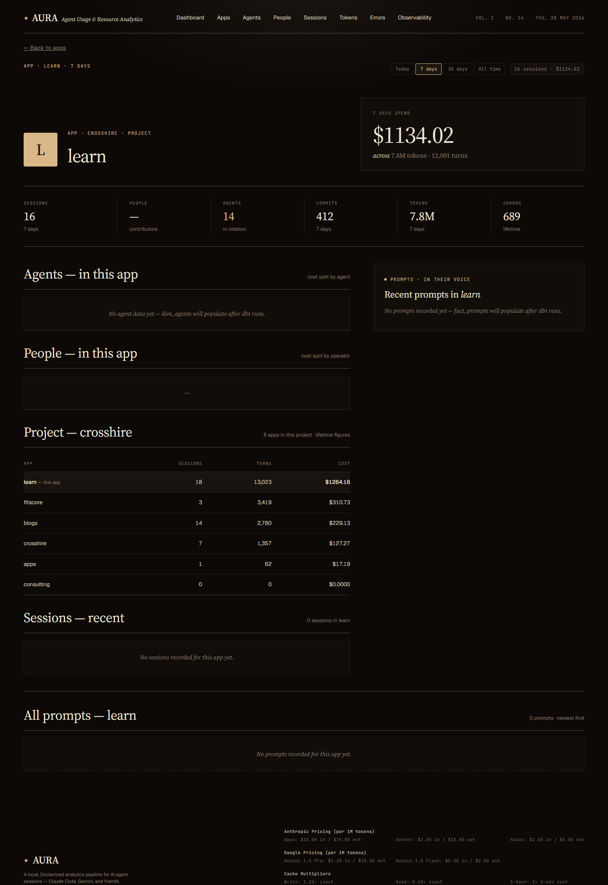
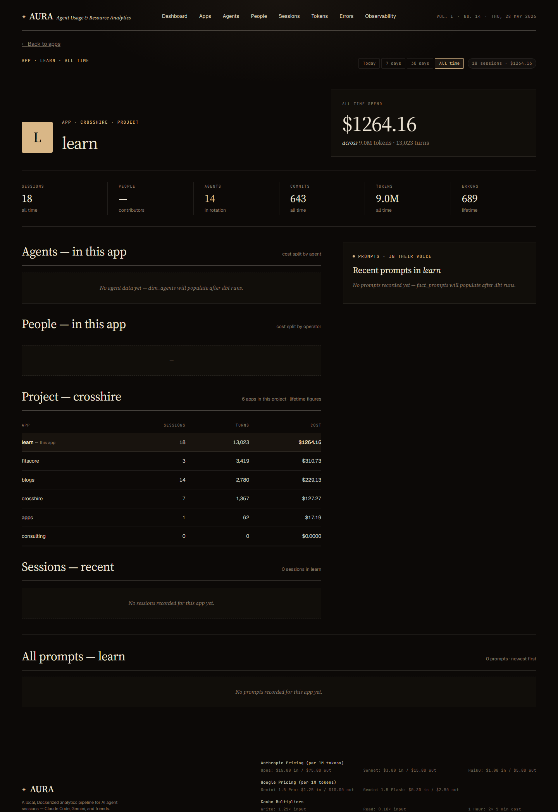

# App detail — Aura

**URL:** `/apps/<appId>`  
**Sample:** `learn` (top app by cost)  
**Primary range:** 7d  
**Variants:** all-time (`?range=all`)

## What this screen shows

Deep dive into a single working directory (app). Shows cost, sessions, agent/people breakdown, related projects, recent sessions, and a chronological feed of all prompts executed within the app. Lets you track which agents worked on a codebase, who drove sessions, commit activity, and the voice/intent of the work via stored prompts.

## Layout & components

- **Masthead strap** — app name, range selector (7d/30d/all), session count + cost pill
- **Profile head** — large app initial glyph, app title, project affiliation, hero spend stat (cost/tokens/turns)
- **6-stat strip** — Sessions, People, Agents, Commits, Tokens, Errors (lifetime unless range-filtered)
- **Agents ledger** — cost split by agent (cost share bar)
- **People ledger** — cost split by person_id (cost share bar)
- **Project section** — sibling apps in the same project_id (if any)
- **Sessions ledger** — recent sessions (12 max), linked to session detail page
- **All prompts section** — full chronological feed of every prompt in this app, newest first

## Data sources

| Component | Query | Mart |
|---|---|---|
| App metadata, lifetime KPIs | `getApp()` | `dim_apps` + `dim_projects` |
| Range-filtered KPIs | `getAppRangeAggregates()` | `int_entity_spend` + `dim_sessions` |
| Agents cost breakdown | `getAppAgents()` | `dim_agents` (lifetime) or `fact_model_calls` (range) |
| People cost breakdown | `getAppPeople()` | `dim_sessions` → `fact_model_calls` (range) |
| Sessions (recent 12) | `getAppSessions()` | `dim_sessions` |
| Sibling apps | `getProjectApps()` | `dim_apps` |
| Top 6 prompts | `getAppPrompts()` | `fact_prompts` (filtered by `appId` via cwd) |
| All prompts (paginated) | `getAppAllPrompts()` | `fact_prompts` (chronological, newest first) |

## How to read it

- **Hero stat** — spend in selected range vs. lifetime (falls back to `dim_apps` if no range).
- **6-stat strip** — KPIs reflect range if selected, lifetime otherwise; "Agents" is agent count, "Commits" is git commits during the range.
- **Agents/People tables** — cost is aggregated from `fact_model_calls` when range is active (accurate date filtering); share bar is % of max cost in that group.
- **Sessions** — shows last 12 sessions in reverse chrono (newest first); cost is per session; linked to `/sessions/<id>` for full transcript.
- **All prompts** — newest prompt first; shows agent, model, prompt text (200 char truncation), turn count, tool call count, files touched, output tokens, cost. "OVERKILL" badge marks prompts that used Opus/Sonnet when Haiku would suffice.
- **Project section** — appears only if app has a `project_id`; shows all apps in the project with lifetime metrics; current app is highlighted.

## Edge cases / empty states

- **App with no agents yet** → "No agent data yet — dim_agents will populate after dbt runs."
- **App with no people** → "—" in the People stat, empty ledger with no rows.
- **App with no sessions** → "No sessions recorded for this app yet."
- **App with no prompts** → "No prompts recorded yet — fact_prompts will populate after dbt runs."
- **App with no project_id** → Project section does not render.
- **Range filter with no data** → KPIs fall back to lifetime; range-specific metrics (agents, people) may be empty or show cumulative zeros.

## Related screens

- [Apps list](./apps-list.md) — browse all apps sorted by cost
- [Session detail](./session-detail.md) — view full transcript of a single session
- [Agent dashboard](./agents.md) — all agents active in your workspace
- [People dashboard](./people.md) — all people driving sessions

## Screenshots

**7d range:**

**All-time:**

