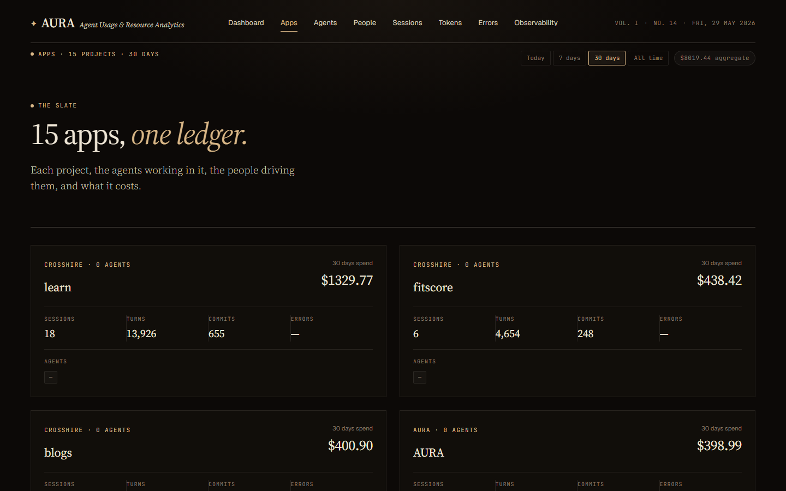
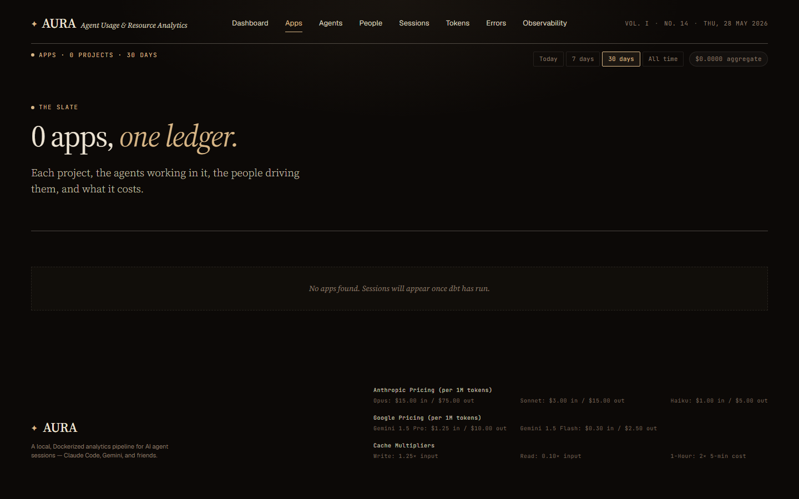

# Apps — list view

**URL:** `/apps`  
**Primary range:** 7d  
**Variants:** 30d

## What this screen shows

Each project in the workspace: agents working in it, people driving them, and what it costs. Ranked by total spend per app.

## Layout & components

- **Masthead strap:** app count + range filter + total aggregate spend
- **Hero section:** headline "N apps, one ledger." + lede
- **Apps grid:** card-per-app, each showing:
  - App name, project ID, agent count, description (first 200 chars)
  - Cost badge (top-right, range-aware)
  - Stats row: sessions / turns / commits / errors
  - Agent chips (capped at 5, +N for overflow; now shows actual subagent names)

## Data sources

| Component | Query | Mart |
|---|---|---|
| Apps list (no range) | `getApps()` | `dim_apps` |
| Apps list (ranged) | `getApps(since)` | `int_entity_spend` × `dim_apps` |
| Total cost | `getAppsTotalCost(since)` | `int_entity_spend` |

## How to read it

- Each app = one cwd-rooted project (e.g., `AURA`, `Claude Code`)
- **Cost:** top-right badge; sum of all model calls in that project for the range
- **Agents:** actual subagent names (runner, frontend-engineer, dbt-expert, etc.), not placeholder 'claude'
- **Stats:** sessions=distinct sessions; turns=total message turns; commits=tied to sessions; errors=NULL for ranged queries (no timestamp on fact_errors)
- Click any card to navigate to app detail view

## Edge cases / empty states

- No apps: "No apps found. Sessions will appear once dbt has run."
- App with no project_id: uses app_id
- Ranged query with errors: NULL (range queries don't include errors)
- Agent_count and agents array: NULL for ranged queries (use dim_agents lifetime for detail view)

## Related screens

- [App detail](./app-detail.md)
- [Dashboard](./dashboard.md)
- [Agents list](./agents-list.md)

## Screenshots

- 7d: 
- 30d: 
