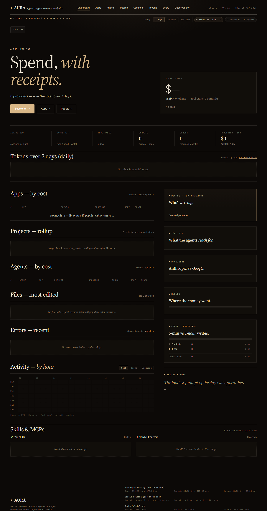
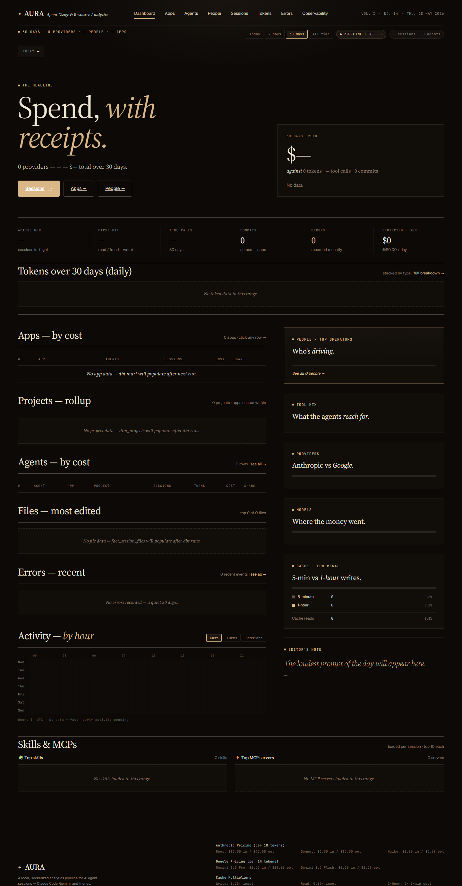
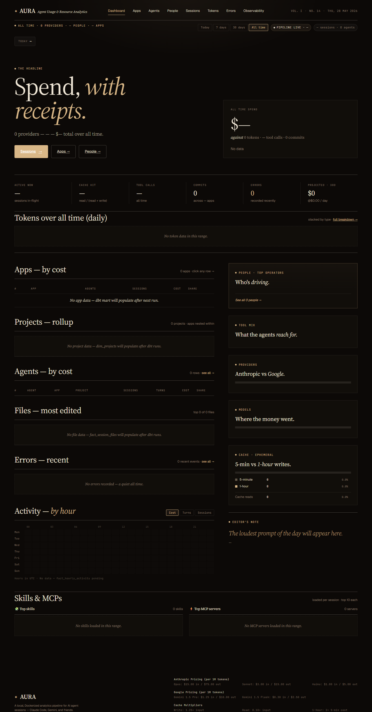

# Dashboard (home)

**URL:** `/`  
**Primary range:** 7d  
**Variants captured:** today (hourly token chart), 30d, all-time

## What this screen shows

Aura's single summary page. Shows total spend with cost breakdowns by app, project, agent; KPI tiles; token volume (stacked by type); recent errors; and core operational context (top files, people, tools, providers, models, cache, skills & MCPs).

## Layout & components (top → bottom)

- **Masthead strap** — range label, provider count, people count, app count; range filter; pipeline status; session + agent totals
- **Burn rate strip** — today's projected 30-day spend vs. rolling 30d average (context for spend pace)
- **Hero section** — "Spend, with receipts" headline; hero stat (total cost over range, token/tool/commit counts); sparkline of daily spend
- **KPI strip** — 6 metric tiles: active sessions, cache hit rate, tool calls, commits, errors, projected 30d cost
- **Token volume chart** — stacked bars, distinct palette (teal/gold/orange/violet/slate), 180px height; hourly for today, daily for longer ranges
- **Apps ledger** — top 10 by cost; agent count, sessions, cost, cost share bar
- **Projects ledger** — rollup view; nested apps within each project
- **Agents ledger** — top 20 by cost; app, project, sessions, turns, cost, share bar
- **Files section** — top 8 most-edited files; edit count bar per file
- **Errors section** — recent 5 errors; when, severity, kind, tool, message, session link
- **Activity heatmap** — day-of-week × hour-of-day grid; turn count + cost + session starts
- **Side panel** (right) — stacked cards: top 6 people (NOW SHOWS real names), tool mix (top 12 tools by call count), providers (cost split), models (top 8 of N), cache (5m vs 1h writes + reads), editor's note (loudest prompt of day)
- **Skills & MCPs section** (BOTTOM) — 2-column layout; top 10 each; skill/MCP name, session count, last used date

## Data sources

| Component | Query | Mart |
|---|---|---|
| KPIs | `getDashboardKPIs` | `dim_sessions`, `fact_daily_spend` |
| Daily spend sparkline | `getDailySpend` | `fact_daily_spend` |
| Token chart | `getTokenSeries` | `fact_model_calls` (hourly/daily bucket) |
| Top apps | `getTopApps` | `dim_apps` or `int_entity_spend` |
| Top projects + nested apps | `getTopProjects` | `dim_sessions`, `int_app_cwd_lookup`, `dim_projects` |
| Top agents | `getTopAgents` | `dim_agents` or `int_entity_spend` |
| Recent errors | `getRecentErrors` | `fact_errors` |
| Top files | `getTopFiles` | `fact_session_files` (joined to `dim_sessions`) |
| Top people | `getTopPeople` | `dim_people` or `int_entity_spend` |
| Tool mix | `getToolMix` | `fact_tool_executions` |
| Providers split | `getProviderSplit` | `fact_daily_spend` |
| Model breakdown | `getModelBreakdown` | `fact_daily_spend` |
| Spend pace | `getSpendPace` | `fact_spend_pace` |
| Hourly activity heatmap | `getHourlyActivity` | `fact_hourly_activity` |
| Top skills | `getTopSkills` | `raw_session_skills` × `dim_sessions` |
| Top MCPs | `getTopMcps` | `raw_session_mcps` × `dim_sessions` |

## How to read it

**Cost drivers:** Apps ledger shows which codebases burn most; Projects nested view reveals cost per team structure. Agents ledger isolates agent-level spend (runner, subagent roles, etc.).

**Token health:** Token chart shows input/output split plus cache behavior (ephemeral 5m/1h writes, read cache). Palette: teal (input) → gold (output) → orange (5m) → violet (1h) → slate (read).

**People:** Top people card now surfaces real names from `person_name` in `dim_people`; click through to `/people`.

**Skills & MCPs:** Newly positioned at bottom; empty until first dbt cycle after parser deploy populates `raw_session_skills` and `raw_session_mcps`. Useful for tracking agent capability adoption without cluttering headline metrics.

**Empty states:** Any range with no data shows empty blocks per section (normal for fresh installs or time windows outside collected history).

## Edge cases / empty states

- Fresh install (no `dim_sessions`, `raw_session_skills`, `raw_session_mcps`): dashboard renders with null KPIs, empty tables, empty Skills & MCPs section. Messages prompt "dbt mart will populate after next run."
- Projects empty: shows message; Apps and Agents ledgers still populate.
- No errors in range: "A quiet [range]."
- Skills/MCPs empty: "No skills/MCPs loaded in this range."
- People without names: falls back to `person_id`; fixed with recent parser update.

## Related screens

- [Sessions list](./sessions-list.md) — drill-down to individual session detail
- [Apps detail](./apps-detail.md) — per-app cost & session breakdown
- [People detail](./people-detail.md) — per-person spending & skill mix
- [Tokens drill-down](./tokens-page.md) — full token volume by model / provider
- [Errors detail](./errors-page.md) — all errors with filters and drill-down
- [Agents list](./agents-list.md) — agent-level cost and session counts

## Screenshots

- 7d (primary): 
- Today (hourly): 
- 30d: 
- All-time: 
