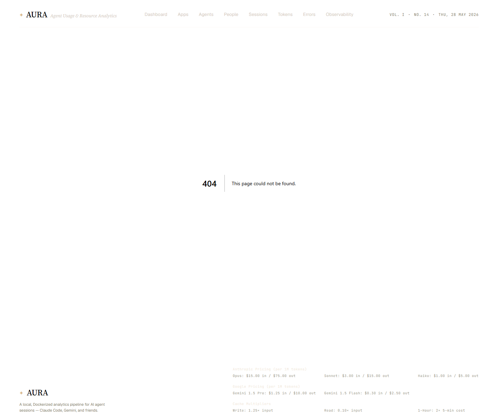

# 404 / Not-found state

**URL:** `/sessions/<unknown-id>` (or any non-existent dynamic route)  
**Status:** 404

## What this screen shows

Aura's default Next.js 404 page, displayed when a user navigates to a non-existent session, app, agent, or person. This is the fallback UI for resource-not-found errors.

## Trigger

- Server component (e.g., `[sessionId]/page.tsx`) calls `getSession(id)` or equivalent
- Query returns `null` (entity does not exist in DuckDB)
- Component calls `notFound()` from `next/navigation`
- Next.js renders the default 404 UI (no custom `not-found.tsx` in the app directory)

## Layout

The screenshot shows the default Next.js 404 chrome — a simple page indicating the resource could not be found, with a back-to-home link or similar navigation.

## Other pages with the same pattern

- `/apps/<unknown>` — `frontend/app/apps/[appId]/page.tsx` calls `notFound()`
- `/agents/<unknown>` — same pattern  
- `/people/<unknown>` — same pattern

## Related screens

- [Dashboard](./dashboard.md)
- [Sessions list](./sessions-list.md)

## Screenshot

