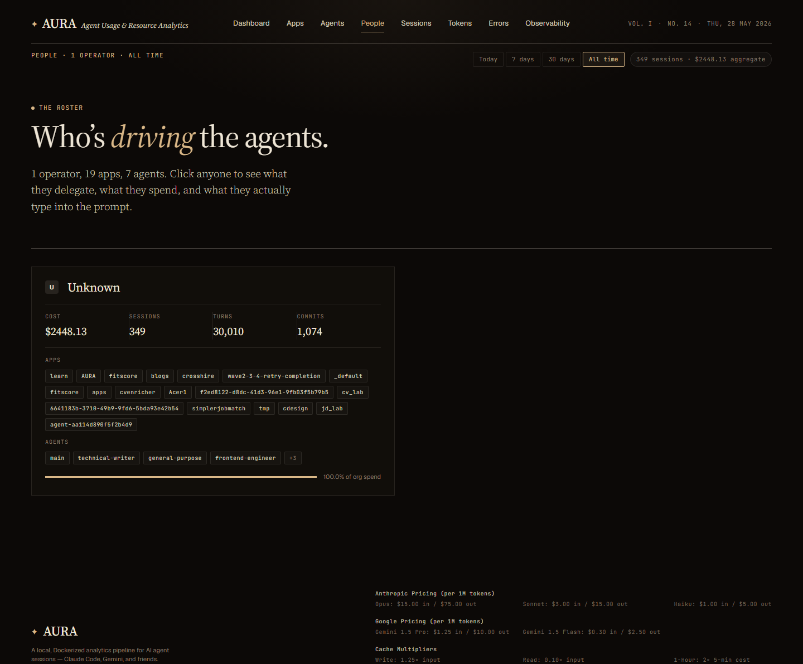

# People — list view

**URL:** `/people`  
**Primary range:** 7d  
**Variants:** all-time (`?range=all`)

## What this screen shows

Roster of operators / developers, derived from `session_meta.person_id`. Names are resolved via identity mart (`dim_people`). Each card displays aggregate cost, session count, agent & app breadth, and relative spend as a percentage of total organization cost across the selected time range.

## Layout & components

- **Masthead strap:** title + operator count + range filter + total spend pill
- **Hero section:** "Who's driving the agents" + expanded stats (apps, agents touched)
- **People grid:** one clickable card per person, containing:
  - Avatar + name + (optional) role
  - Cost, sessions, turns, commits KPIs
  - Chips: Apps used + Agents touched (first 4, "+N more" if needed)
  - Relative spend bar (normalized to top spender)

## Data sources

| Component | Query | Source Mart | Note |
|---|---|---|---|
| Roster (lifetime, `?range=` omitted or `all`) | `SELECT * FROM dim_people ORDER BY total_cost DESC` | `dim_people` | Fast path; no time filtering |
| Roster (7d/30d/90d) | `SELECT ... FROM int_entity_spend es LEFT JOIN dim_people dp ...` | `int_entity_spend` + `dim_people` | Aggregates by date; apps/agents arrays sourced from lifetime mart |
| Person detail (detail page) | `SELECT * FROM dim_people WHERE person_id = ?` | `dim_people` | Same mart, keyed lookup |

## How to read it

- People list is sourced from `dim_people`, built by rollups on `session_meta.person_id`.
- When a date range is applied (7d, 30d, 90d), the cost/session/turn counts are re-aggregated from `int_entity_spend` for accuracy, but chips (apps & agents) remain lifetime aggregates from `dim_people` (the range only affects the KPI numbers, not the chips).
- Sorting is always by `total_cost DESC`, with NULLs last.

## Edge cases / empty states

- **KNOWN gap:** At time of capture, the list shows mostly "Unknown" — `session_meta.person_id` is only written on file create, not during backfill. Historic/backfilled sessions will not have a person_id until a fresh session is created.
- Empty person_id or missing `~/.aura/people.json` resolution falls back to `person_id` value.
- Zero operators renders masthead as "0 operators" with empty grid.

## Related screens

- [Person detail](./person-detail.md)
- [Dashboard — Top people panel](./dashboard.md)

## Screenshots

- **7d (primary):** 
- **All-time:** 
