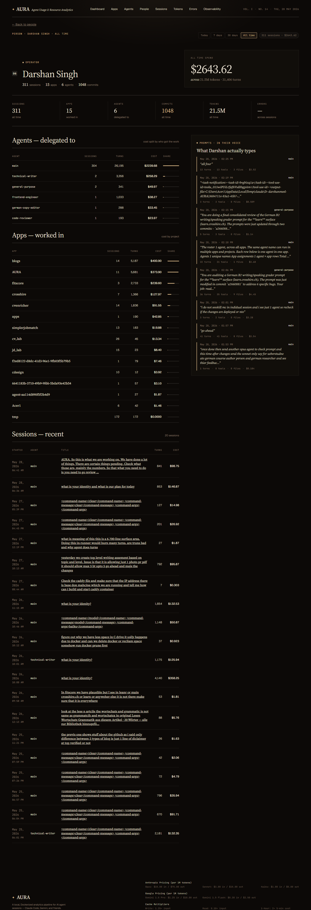

# Person detail

**URL:** `/people/<personId>`  
**Sample:** `darshan` (the configured operator — 311 sessions)  
**Primary range:** 7d  
**Variants:** all-time

## What this screen shows

Comprehensive profile of a single operator across all their work: total spend, sessions initiated, agents delegated to, apps worked in, and recent prompts in their own voice. Supports time-range filtering to isolate current week or all-time activity.

## Layout & components

- **Masthead strap** — person ID, name, range filter, quick summary (session count + total cost)
- **Profile head** — avatar, role, name, metadata (sessions / apps / agents / commits) + hero stat (range spend, tokens, turns)
- **Stat strip** — 6 KPIs: Sessions, Apps, Agents, Commits, Tokens, Errors
- **Main column** — 3 ledger tables: Agents delegated to (cost by agent), Apps worked in (cost by app), Recent sessions (20 most recent)
- **Side panel** — Prompts sidebar (8 recent prompts in operator's voice with mini-stats: turns, tools, files, cost)

## Data sources

| Component | Query | Mart |
|---|---|---|
| Person profile | `getPerson` | `dim_people` |
| Sessions (range) | `getPersonSessions` | `dim_sessions` |
| Agents (range) | `getPersonAgents` | `fact_model_calls` ∪ `dim_sessions` |
| Apps (range) | `getPersonApps` | `fact_model_calls` ∪ `dim_apps` |
| Range aggregates | `getPersonRangeAggregates` | `int_entity_spend` |
| Prompts | `getPersonPrompts` | `fact_prompts` |

## How to read it

- **Person identity** — sourced from `session_meta` (environment variable `AURA_DEFAULT_PERSON_ID` if set, else extracted from JSONL)
- **Session count badge** — counts sessions in the selected range; lifetime fallback when no range filter
- **Cost split** — agents and apps show proportional bars (each row normalized to max cost in that category)
- **Recent sessions** — limited to 20 most recent in the range; click title to drill into session detail
- **Prompts sidebar** — shows 8 recent prompts; metadata includes timestamp, agent, turn count, tool calls, files edited, and cost

## Edge cases / empty states

- **Unknown person_id** — 404 (checked via `getPerson` null guard on line 57)
- **Person with no sessions** — main column shows empty blocks ("No agent data yet", "No app data yet", "No sessions recorded yet")
- **No prompts available** — sidebar hidden; fact_prompts table may not exist on all installations (try/catch on line 52)
- **Range with zero data** — KPI numbers show 0; tables empty; range aggregates fall back to lifetime if sinceClause produces no rows

## Related screens

- [People list](./people-list.md)
- [Session detail](./session-detail.md)
- [Apps](./apps.md)
- [Agents](./agents.md)

## Screenshots

- 7d: 
- All: 
