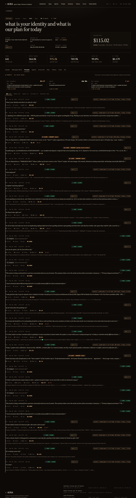
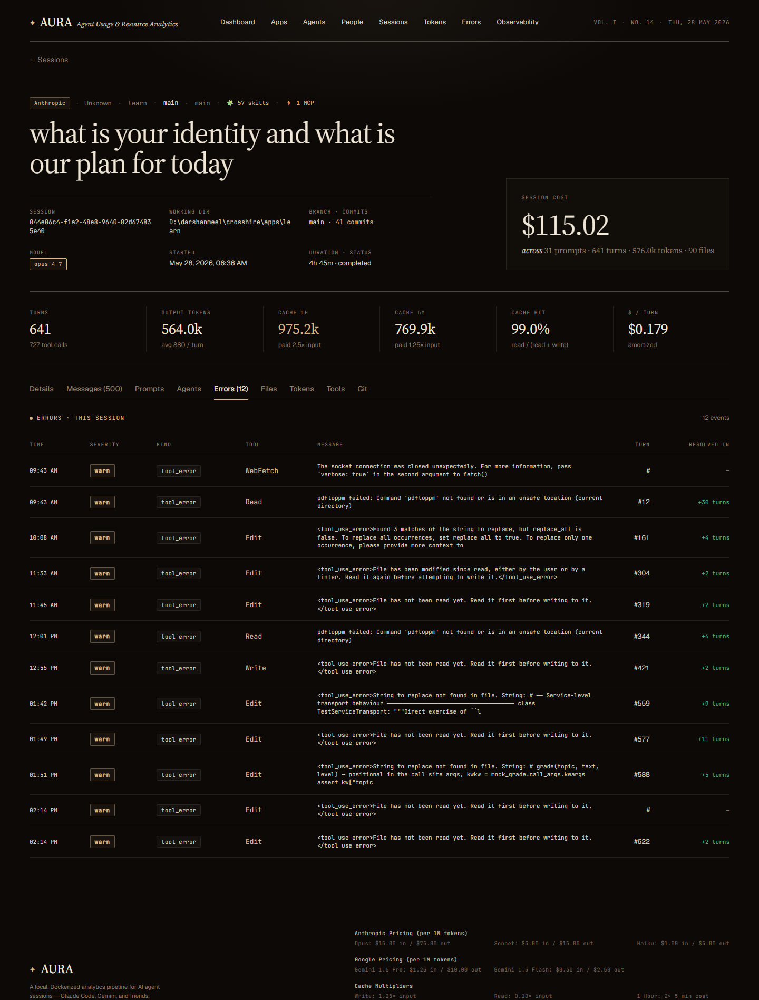
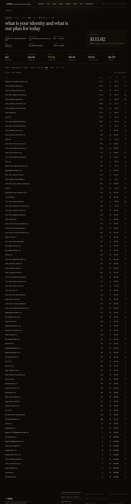
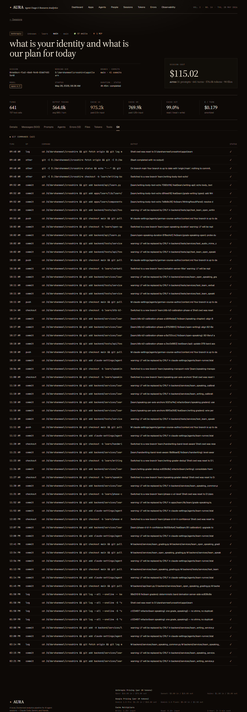

# Session detail

**URL:** `/sessions/<sessionId>`  
**Sample:** `044e06c4-f1a2-48e8-9640-02d674835e40` (57 skills, 3 agents, $115, 641 turns)  
**Primary range:** N/A (session-scoped)

## What this screen shows

Deep-dive into a single Claude Code session. Displays conversation transcripts, prompts, tool invocations, errors, costs, and tokens per-turn. Masthead renders all agents with tally. NEW: Dedicated "Skills & MCPs loaded" section between KPI strip and tabs shows visible chip lists of every skill and MCP server (no hover needed). Nine tabs (Details, Messages, Prompts, Agents, Errors, Files, Tokens, Tools, Git) reveal different dimensions of the same session.

## Masthead & eyebrow

- **Eyebrow chips:** Provider, person, cwd (folder name only), agent strip (all agents + "(N agents)" tally if > 1), git branch, 🧩 N skills, ⚡ N MCPs
- **Title:** Display name (first 120 chars), split at · for italic second part
- **Meta grid (3×2):** Session ID, working dir, branch · commit count, model pill, started, duration · status
- **Right:** SESSION COST hero stat with footer: X prompts · Y turns · Z tokens · N files

## KPI strip

6 inline metrics: Turns (+ N tool calls) · Output tokens (avg per turn) · Cache 1h (paid 2.5×) · Cache 5m (paid 1.25×) · Cache hit % · $ per turn (amortized)

## NEW — Skills & MCPs loaded section

- **Visibility:** Renders only when session has ≥ 1 skill OR ≥ 1 MCP server; hides entirely otherwise
- **Layout:** Two-column grid with header tally ("X skills · Y MCPs")
- **Skills column:** Label "🧩 Skills", flex-wrapped monospace chips (accent colour, 11px, 1px border, 2px padding)
- **MCPs column:** Label "⚡ MCP servers", flex-wrapped monospace chips (accent-2 colour, 11px, 1px border, 2px padding)
- **Empty state:** If count > 0 but array is empty: "No skills loaded." / "No MCP servers loaded."
- **Names visible:** Skill and MCP names appear directly as chip text — no hover required

## Tabs (9 total, client-side in SessionTabs.tsx)

| Tab | What it shows | Count badge | Data source |
|---|---|---|---|
| **Details** (default) | Overview, prompt heroes (most expensive, longest, most errored), thinking blocks, error resolutions, tool-mix pie | — | sessions.ts, fact_prompts, stg_events |
| **Messages** | Per-turn USER↔CLAUDE / SUBAGENT flow. Direction icons + colours (green=human, orange=agent). Overkill flags. Tool list. Thinking blocks. | (N turns) | int_turns, stg_events |
| **Prompts** | User & agent prompts, text preview, hero strip, filter chips (All/Human/Agent/Errored/Overkill). Per-prompt: model, cost, cache rate, TTFT, tool signature, retry count. | — | fact_prompts |
| **Agents** | Agent/subagent breakdown per turn. Distribution chart. | — | int_event_agent |
| **Errors** | Error ledger: timestamp, kind, tool, message, severity tag, turn #, resolved-in count | (N errors) | fact_errors |
| **Files** | Files touched: path, file type, read/edit attribution, counts | — | fact_session_files |
| **Tokens** | Per-turn stacked bar chart (cache read, ephemeral 5m+1h, output, input) + context % overlay line. X-axis every 10 turns. | — | fact_turns |
| **Tools** | Tool-call ledger: name, call timestamp, result timestamp, duration, error flag, file path | — | fact_tool_executions |
| **Git** | Git commands: command text, timestamp, success/error | — | fact_git_commands |

## How to read it

- **Multi-agent sessions:** Masthead agent strip lists every agent (main, runner, subagents) with "(N agents)" tally if > 1. Details about which agent handled which turn appear in Agents tab.
- **Skills & MCPs visibility:** If zero skills AND zero MCPs, the "Skills & MCPs loaded" section hides entirely. Section always appears between KPI strip and tabs (when ≥ 1 of either).
- **Message direction:** USER→CLAUDE (green) = human typed. CLAUDE→SUBAGENT (orange) = dispatch/orchestrator. Detected via prefix patterns.
- **Tab badges:** Messages shows "(N)" for turn count. Errors shows "(N)" for error count. Other tabs hide badges if empty.
- **Overkill flags:** Prompts tab marks multi-turn sequences with "overkill: <reason>" when task finishes sooner than expected.
- **Cache colours:** Cache hit % uses green (≥80%), accent (≥50%), or warn (<50%).
- **Thinking blocks:** Collapsed by default; click "💭 show thinking" on Messages tab to expand.

## Edge cases / empty states

- **Session not found:** Returns 404 (notFound).
- **Zero skills + zero MCPs:** "Skills & MCPs loaded" section does not render.
- **No turns:** Details tab shows "Per-turn detail not retained." in TurnChart; Messages badge hides.
- **No errors:** Errors tab badge hides; empty state shown.
- **No files:** Files tab shows empty list.
- **No tools:** Tools tab shows empty list.
- **No git commands:** Git tab shows empty list.
- **Session active:** `end_ts` NULL; status badge shows "active".
- **Long sessions:** Prompts & Messages paginate; "show all" via `?turns=all` query param.

## Related screens

- [Sessions list](./sessions-list.md)
- [App detail](./app-detail.md)
- [Provider dashboard](./provider-dashboard.md)

## Screenshots

- **Details tab (default):** 
- **Messages:** 
- **Prompts:** 
- **Agents:** 
- **Errors:** 
- **Files:** 
- **Tokens:** 
- **Tools:** 
- **Git:** 
