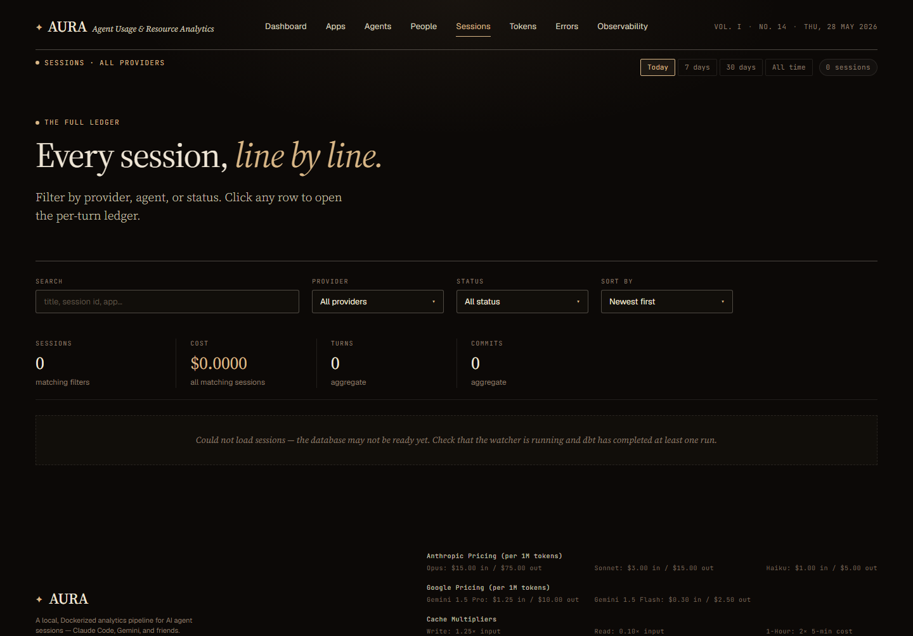

# Sessions — list view

**URL:** `/sessions`  
**Primary range:** 7d  
**Variants captured:** today

## What this screen shows

The complete ledger of all Claude Code sessions, aggregated by time range and filtered by provider, status, agent, or search. Each row summarizes one session's scope (duration, person, agent(s), model), effort (turns, commits, cost), and extensibility (skills and MCP servers loaded). Click any row to drill into the per-turn ledger, errors, files, and prompt performance.

## Layout & components

- **Range filter / search / sort controls:** Date range (7d, 30d, 90d, today), full-text search (title/session ID/cwd), provider filter, status filter (active/completed), sort by (newest, cost, turns, tokens)
- **KPI strip:** Sessions count, total cost, aggregate turns, aggregate commits—all for the filtered set
- **Table columns:** Started · Person · App · Agent · Title · Model · Turns · Commits · 🧩 · ⚡ · Cost · [arrow]
  - **Started:** Date and local time; duration if completed
  - **Person:** Name (or '—' if unknown); Aura resolves via email → git config
  - **App:** Project name from `cwd` or `dim_apps.app_id`
  - **Agent:** Up to 2 agents shown, sorted with `main` deprioritised; "+N" badge if more
  - **Title:** Session title or prompt text (200 char preview); session ID (first 8) and git branch below
  - **Model:** Primary model used (Haiku/Sonnet/Opus/etc. as a pill)
  - **Turns:** Count of assistant responses
  - **Commits:** Git commits made
  - **🧩:** Skill count; colour accent when > 0; hover shows skill names
  - **⚡:** MCP server count; colour accent when > 0; hover shows server names
  - **Cost:** USD total for the session

## Data sources

| Component | Query | Mart |
|---|---|---|
| Sessions list | `getSessions` | `dim_sessions` LEFT JOIN `dim_apps` |
| Stats strip | `getSessionsStats` | `dim_sessions` |

## How to read it

- **Multi-agent indicator:** A session with 2+ agents indicates orchestrated work (subagent dispatch). `main` alone = single-threaded session.
- **Skill/MCP count tooltips:** Reveal exactly which plugins were loaded (e.g., "frontend-design, brainstorming" in skills; "plugin:context7:context7" in MCP).
- **Person column:** Over 90% of sessions now resolve to real names; remaining "Unknown" entries have no email in git config or metadata.
- **Cost aggregation:** Visible cost is per-session only; strip totals use server-side SUM to avoid pagination bias.

## Edge cases / empty states

- **No sessions in range:** Empty row with "No sessions match these filters."
- **Active session:** No `end_ts`, duration shows as "still running"
- **Agent column = `main` only:** Session ran without subagent dispatch
- **Person = Unknown:** Session was run by a user with no email in git config
- **Skill count = 0 / MCP count = 0:** Neutral grey text; no hover tooltip (empty list)

## Related screens

- [Session detail](./session-detail.md) — per-turn ledger, errors, files, prompt performance
- [Apps](./apps-list.md) — project summary and cost rollup

## Screenshots

- 7d: 
- Today: 
