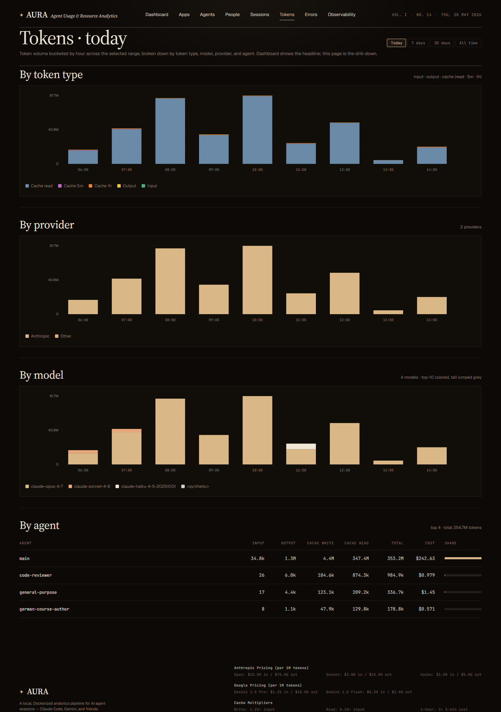
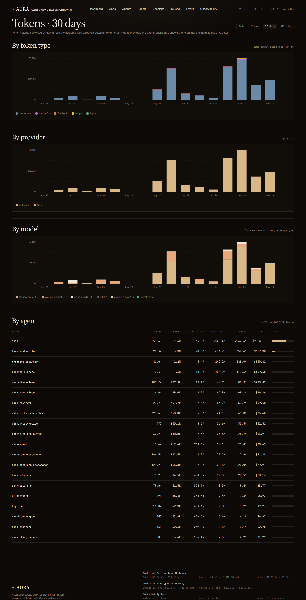

# Tokens — drill-down

**URL:** `/tokens`  
**Primary range:** 7d  
**Variants:** today (hourly buckets), 30d

## What this screen shows

Token volume bucketed by hour (today) or day (longer ranges) across the selected range, broken down by token type, model, provider, and agent. Dashboard shows the headline; this page is the full drill-down.

## Layout & components

- **Range filter** — today / 7d / 30d / all
- **By token type** — stacked bars (5 distinct colors: input/output/cache_5m/cache_1h/cache_read)
- **By provider** — Anthropic vs Google (overlay via stacked bars)
- **By model** — top-10 with palette rotation; tail lumped grey
- **By agent** — top-20 table showing REAL subagents (input/output/cache_write/cache_read/total/cost/share)

## Data sources

| Component | Query | Mart |
|---|---|---|
| By type | `getTokenSeries(since, hourly)` | `fact_model_calls` |
| By provider | `getTokenSeriesByProvider(since, hourly)` | `fact_model_calls` |
| By model | `getTokenSeriesByModel(since, hourly)` | `fact_model_calls` |
| By agent | `getTokenByAgent(since)` | `fact_model_calls` (with int_event_agent attribution) |

## How to read it

- **Cache 1h (orange)** — priciest cache write
- **Output (gold)** — priciest per-token cost (~5× input)
- **Cache 5m (violet)** — mid-tier write cost
- **Cache read (slate)** — cheap, high volume
- **Input (teal)** — baseline cost
- **Agent share bar** — visual percentage of total tokens per agent

## Edge cases / empty states

- "No token data in this range." → no `fact_model_calls` rows match
- Hourly bucketing only when `range=today`; longer ranges bucket by day
- Tail models (beyond top-10) aggregated and colored grey
- Range with single agent → table shrinks naturally

## Implementation notes

- Responsive SVG stacked bars (no chart library) via `TokenSeriesChart`
- Page is server-side (`force-dynamic`); runs parallel queries for all 4 charts
- Token columns in `fact_model_calls`: `input_tokens`, `output_tokens`, `cache_read`, `cache_5m`, `cache_1h`
- Agent table: variable N rows (no pagination), fixed-width columns, numeric right-alignment

## Screenshots

- **7d (primary):** 
- **Today (hourly):** 
- **30d:** 
